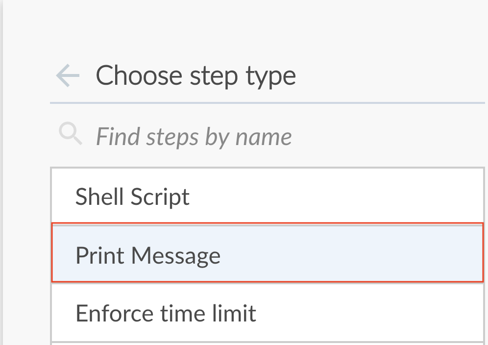

# 10. Jenkins Pipeline Overview


You will learn:
- what a pipeline is
- how to configure pipeline

Pipeline requirements:
- Jenkins 2.x or later
- Pipeline plugin (installed as part of the "suggested plugins")


## 10.1 Anti-Pattern 1: Aggregate Entire Workflow into One Job


Downsides: 
- __difficult to visualize__ a workflow spanning multiple steps
- can't create __manual approval step__ prior to deployment
- can't build and test on a variety of OS platforms __in parallel__


## 10.2 Anti-Pattern 2: Separate Workflow into Jobs
Although this is possible:

__Jenkins Job A ---- (triggers)----> Jenkins Job B__


Downsides:
- can't create __manual approval__ step prior to deployment
- can't build and test on a variety of OS platforms __in parallel__
- __difficult visualize__ a workflow spanning multiple Freestyle jobs


## 10.3 Freejob vs Pipeline
Ref: https://www.jenkins.io/doc/book/pipeline/#why

Freejob:

- good for simple one-off job (i.e. pull from Git, build, and test)
- can't quite visualize flows (just logs from top to bottom)
- can't have logically separate steps 
- can chain multiple Jobs to perform __sequential tasks__ (but __Pipeline does it by default__)


Pipeline:

- can model and visualize logical steps
- good for complex flows (i.e. CI, parallel steps, __manual approval__, then CD)
- can configure Jenkins pipeline as a code, achieving __IaC__. Store `Jenkinsfile` in SCM, apply versioning, tracking and auditing to the job configuration itself.
- Jenkinsfile can be either "Scripted" or "Declarative" types (https://www.jenkins.io/doc/book/pipeline/#declarative-versus-scripted-pipeline-syntax)
- Durable: Pipelines can survive both planned and unplanned restarts of the Jenkins controller.


Pipeline can be created in 3 ways:
- classic Jenkins UI
  
  
- [__What we will focus__] writting Jenkinsfile code manually and commiting to the repo
- [Blue Ocean Plugin](https://www.jenkins.io/doc/book/blueocean/creating-pipelines/)
  
  


## 10.4 Pipelines Quick Demo
Ref: https://www.jenkins.io/doc/book/pipeline/getting-started/#through-the-classic-ui

### 10.4.1 Classic Jenkins GUI
Create simple Jenkins Pipeline from classic Jenkins GUI


Enter this code
```groovy
pipeline {
    agent any 
    stages {
        stage('Stage 1') {
            steps {
                echo 'Hello world!' 
            }
        }
    }
}
```


### 10.4.2 Create Jenkins Pipeline using Blue Ocean GUI
First, install `Blue Ocean` Plugin from `Manage Jenkins` > `Manage Plugins`





Clicking the `Save` button will make Blue Ocean push a commit with changes to Jenkinsfile to Git.


At the time of this writing, the post-build actions cannot be configured through the UI. You need to add them to the Jenkinsfile directly. You can open Jenkinsfile from the Pipeline editor by clicking __Command+S on MacOS__, __Ctrl+S on Windows__, or the equivalent on other operating systems.

```groovy
  post {
    success {
      mail to: 'devops@test.com',
      subject: "Successful Pipeline Run! ${currentBuild.fullDisplayName}",
      body: " For details about the pipeline run, see ${env.BUILD_URL}"
    }
  }
``` 


Since we have confiugured to push build status from Jenkins to Git, the git commit by Blue Ocean shows green checkmark!


