# 11. Configure Jenkins Pipeline using Jenkinsfile

## 11.1 Pipelines Terminology
- https://www.jenkins.io/doc/book/pipeline/#pipeline-concepts

### Pipeline
A Pipeline is a __user-defined model of a CD pipeline__. A Pipeline’s code defines your __entire build process__, which typically includes stages for building an application, testing it and then delivering it.

### Master
A machine where Jenkins is installed and configurations are stored, and what renders the Jenkins UI.

### Agent
Listens to Jenkins master for instructions and offload work from master by running Jenkins Jobs or Pipelines in separate servers.

### Node
A node is a machine which is part of the Jenkins environment and is capable of executing a Pipeline.

### Stage
A stage block defines a __conceptually distinct subset of tasks__ performed through the entire Pipeline (e.g. __"Build", "Test" and "Deploy" stages__), which is used by many plugins to visualize or present Jenkins Pipeline status/progress.

### Step (e.g. "Build" __Stage__ contains multiple __Steps__)
A single task. Fundamentally, a __step tells Jenkins what to do__ at a particular point in time (or "step" in the process). For example, to execute the shell command make use the sh step: sh 'make'. When a plugin extends the Pipeline DSL, [1] that typically means the plugin has implemented a new step.


## 11.2 Jenkinsfile Anatomy
Ref: https://www.jenkins.io/doc/book/pipeline/#declarative-pipeline-fundamentals

Jenkinsfile (declarative pipeline, which is best practice) in the simplest form:
```groovy
pipeline {
  agent any  // Execute this Pipeline or any of its stages, on any available agent

  stages {
    stage {
      steps {
        sh'echo "Hello World from Jenkins Pipeline!"'
      }
    }
  }
}
```

Jenkinsfile with multiple stages such as `Build` and `Test` etc:
```groovy
pipeline {
    agent any // Execute this Pipeline or any of its stages, on any available agent

    // wrapper stages
    stages {
        stage('Build') { // Defines the "Build" stage
            steps { // Perform some steps related to the "Build" stage
                sh'npm run build' // sh is a Pipeline step (provided by the Pipeline: Nodes and Processes plugin) that executes the given shell command. 
            }
        }
        stage('Test') { 
            steps {
                // sh """ for multi-line shell scripts
                sh """
                  npm run test
                  npm run test:report
                """
            }
        }
        stage('Deploy to Staging') { 
            steps {
            }
        }
        stage('Run Acceptance Tests on Staging') { 
            steps {
            }
        }
        stage('Manual Approval') { 
            steps {
            }
        }
        stage('Deploy to Prod') { 
            steps {
            }
        }
        stage('Run Acceptance Tests on Prod') { 
            steps {
            }
        }
    }
}
```

Jenkinsfile (scripted pipeline, not best practice)
```sh
node {  
    stage('Build') { 
        // 
    }
    stage('Test') { 
        // 
    }
    stage('Deploy') { 
        // 
    }
}
```


## 11.3 Declarative Directive Generator for help
Ref: https://www.jenkins.io/doc/book/pipeline/getting-started/#directive-generator

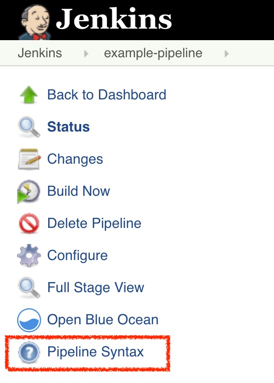
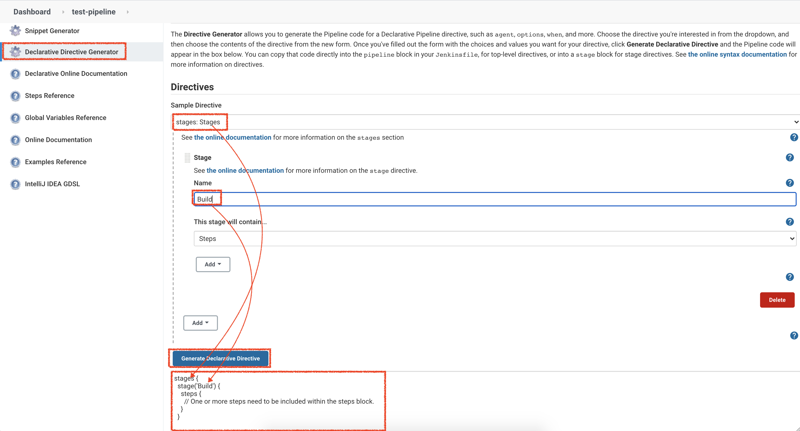


## 11.4 Jenkins Built-in Environment Variables
Ref: https://www.jenkins.io/doc/book/pipeline/jenkinsfile/#using-environment-variables

Jenkins Pipeline exposes environment variables via the global variable env, which is available from anywhere within a Jenkinsfile.

```groovy
pipeline {
    agent any
    stages {
        stage('Jenkins Envs') {
            steps {
                echo "Running ${env.BUILD_ID} on ${env.JENKINS_URL}"

                sh '''
                  echo "Running ${BUILD_NUMBER} and ${BUILD_ID} for ${JOB_NAME} on node ${NODE_NAME} at URL:${JENKINS_URL}"
                '''
            }
        }
    }
}
```

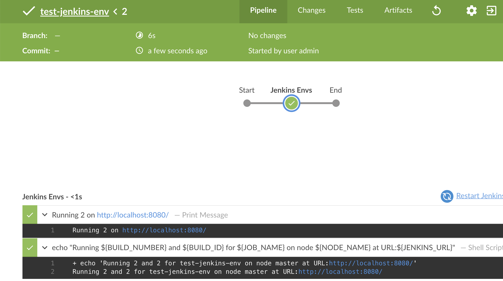


Other built-in Jenkins envs:
- __BUILD_ID__
The current build ID, identical to BUILD_NUMBER for builds created in Jenkins versions 1.597+

- __BUILD_NUMBER__
The current build number, such as "153"

- __BUILD_TAG__
String of jenkins-${JOB_NAME}-${BUILD_NUMBER}. Convenient to put into a resource file, a jar file, etc for easier identification

- __BUILD_URL__
The URL where the results of this build can be found (for example http://buildserver/jenkins/job/MyJobName/17/ )

- __EXECUTOR_NUMBER__
The unique number that identifies the current executor (among executors of the same machine) performing this build. This is the number you see in the "build executor status", except that the number starts from 0, not 1

- __JAVA_HOME__
If your job is configured to use a specific JDK, this variable is set to the JAVA_HOME of the specified JDK. When this variable is set, PATH is also updated to include the bin subdirectory of JAVA_HOME

- __JENKINS_URL__
Full URL of Jenkins, such as https://example.com:port/jenkins/ (NOTE: only available if Jenkins URL set in "System Configuration")

- __JOB_NAME__
Name of the project of this build, such as "foo" or "foo/bar".

- __NODE_NAME__
The name of the node the current build is running on. Set to 'master' for the Jenkins controller.

- __WORKSPACE__
The absolute path of the workspace


## 11.5 Environment Variables
Ref: https://www.jenkins.io/doc/book/pipeline/jenkinsfile/#setting-environment-variables
- Using environment variables: 
  - https://www.youtube.com/watch?v=_t-hZTX97AI&list=PLzvRQMJ9HDiSaisKr7OnM4Fl7JXCDDcmt&index=7
- https://e.printstacktrace.blog/jenkins-pipeline-environment-variables-the-definitive-guide/

Wrap env vars with `environment {}`
```groovy
pipeline {
    agent any
    environment {  // <-------- global-scoped env
        GLOBAL_ENV = 'cat'
    }
    stages {
        stage('Local Stage 1') {
            environment { // <--------  local-scoped env
                LOCAL_ENV_1 = 'dog'
            }
            steps {
                sh 'printenv' // prints GLOBAL_ENV and LOCAL_ENV_1
            }
        }

        stage('Local Stage 2') {
            environment { // <--------  local-scoped env
                LOCAL_ENV_2 = 'bird'
            }
            steps {
                sh 'printenv' // prints GLOBAL_ENV and LOCAL_ENV_2
            }
        }
    }
}
```

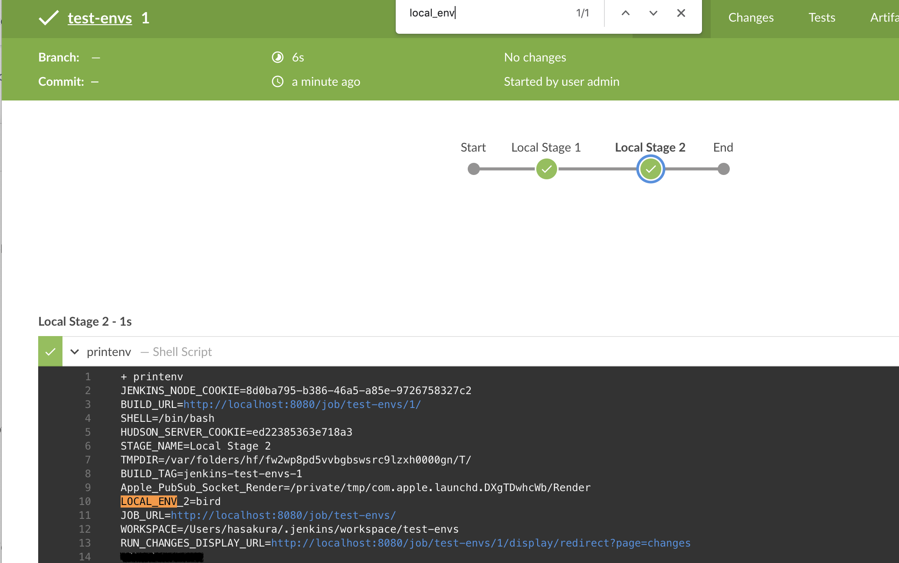


## 11.6 Using Jenkins Credentials
Refs:
- https://www.jenkins.io/doc/book/pipeline/jenkinsfile/#handling-credentials
- https://www.jenkins.io/doc/book/pipeline/syntax/#supported-credentials-type


Example of using __AWS secret access key, kubeconfig file, ssh private key__ stored in Jenkins Credentials in Jenkinsfile using `credentials()` or `withCredentials()`:
```groovy
pipeline {
    agent {
        // Define agent details here
    }
    environment {
        // WARNING: AWS ANTI-PATTERN! Why would you use AWS secret access key which never expires? For AWS SECURITY BEST PRACTICE, You should extract temp AWS secret access key from EC2's instance profile where Jenkins is running

        // these are Jenkins' reserved envs specifically for AWS creds
        // this credential of type "Secret text" must be created beforehand from "Manage Jenkins" > "Manage Credentials"
        AWS_ACCESS_KEY_ID     = credentials('jenkins-aws-secret-key-id') 
        AWS_SECRET_ACCESS_KEY = credentials('jenkins-aws-secret-access-key')


        // The MY_KUBECONFIG environment variable will be assigned the value of a temporary file.  For example:
        //  /home/user/.jenkins/workspace/cred_test@tmp/secretFiles/546a5cf3-9b56-4165-a0fd-19e2afe6b31f/kubeconfig.txt
        MY_KUBECONFIG = credentials('my-kubeconfig') # this credential of type "Secret files" must be created beforehand
    }
    stages {
        stage('Example stage 1') {
            steps {
                // this will only returns the value “****” to reduce the risk of secret information being disclosed to the console output and any logs.
                echo "$AWS_SECRET_ACCESS_KEY" 
            }
        }
        stage('Authenticate to K8s cluster') {
            steps {
                sh("kubectl --kubeconfig $MY_KUBECONFIG get pods")
            }
        }
        stage("Clone private repo") {
            steps {
                // need ssh key for private repo. Ref: https://www.jenkins.io/doc/book/pipeline/jenkinsfile/#for-other-credential-types
                withCredentials([ 
                                sshUserPrivateKey(credentialsId: "bitbucket", // value of this field is the credential ID stored in Jenkins
                                keyFileVariable: 'bitbucket_ssh_key') // name of the environment variable that will be bound to these credentials
                                ]) {

                    // clone private repo 
                    git branch: 'master',
                        credentialsId: 'bitbucket', // using private ssh key
                        url: "${PRIVATE_REPO_URL}"
                }
            }
        }
    }
}
```


## 11.7 Getting User Inputs using Parameters
Refs: 
- https://www.jenkins.io/doc/book/pipeline/jenkinsfile/#handling-parameters
- https://www.jenkins.io/doc/book/pipeline/syntax/#parameters

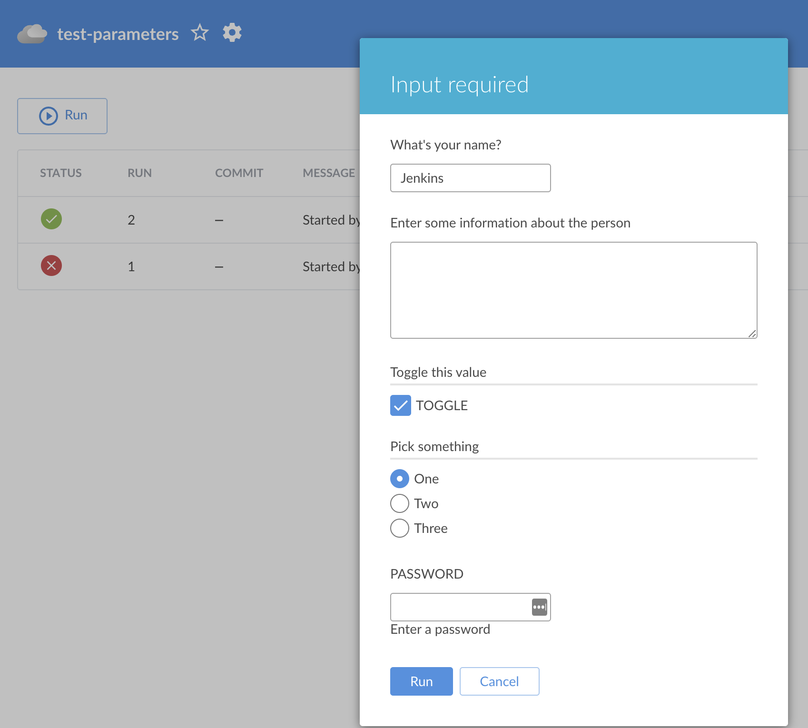

Using `${params.NAME}` syntax:
```groovy
pipeline {
    agent any
    parameters { // <------- parameters can have many types (string, input, )
        string(name: 'PERSON', defaultValue: 'Jenkins', description: "What's your name?")
        
        text(name: 'BIOGRAPHY', defaultValue: '', description: 'Enter some information about the person')

        booleanParam(name: 'TOGGLE', defaultValue: true, description: 'Toggle this value')

        choice(name: 'CHOICE', choices: ['One', 'Two', 'Three'], description: 'Pick something')

        password(name: 'PASSWORD', defaultValue: 'SECRET', description: 'Enter a password')
    }
    stages {
        stage('Example') {
            steps {
                echo "Hello ${params.PERSON}"

                echo "Biography: ${params.BIOGRAPHY}"

                echo "Toggle: ${params.TOGGLE}"

                echo "Choice: ${params.CHOICE}"

                // for sensitive envs, use single quote. Ref: https://www.jenkins.io/doc/book/pipeline/jenkinsfile/#string-interpolation
                echo 'Password: ${params.PASSWORD}'
            }
        }
    }
}
```


## 11.8 Handling Errors
Ref: https://www.jenkins.io/doc/book/pipeline/jenkinsfile/#handling-failure

```groovy
pipeline {
    agent any
    stages {
        stage('Test') {
            steps {
                echo 'Run some tests...'
            }

            post {
                always {
                    echo "Test stage succeeded!"
                }
                failure {
                    mail to: team@example.com, subject: 'The stage failed :('
                }
            }
        }
    }
    post {
        always {
            echo "Entire pipeline succeeded!"
        }
        failure {
            mail to: team@example.com, subject: 'The Pipeline failed :('
        }
    }
}
```


## 11.9 Reuse files acropss multiple stages
Ref: https://www.jenkins.io/doc/book/pipeline/jenkinsfile/#using-multiple-agents

```groovy
pipeline {
    agent any
    stages {
        stage('Build') {
            steps {
                sh'''
                    # Jenkins env BRANCH_NAME will be available for multi-branch pipeline. Ref: https://www.jenkins.io/doc/book/pipeline/multibranch/#additional-environment-variables
                    APP_VERSION=${BRANCH_NAME}-0.1.${BUILD_NUMBER}
                    
                    HELM_CHART_FILE_NAME=app-staging-${APP_VERSION}.tgz

                    mkdir -p outputs

                    echo ${HELM_CHART_FILE_NAME} > outputs/staging-chart-filename.txt && cat outputs/staging-chart-filename.txt
                    
                    ls -l outputs/
                '''
                // stash the dir so next stage{} block can access file
                stash name: "chart_file_name", includes: "outputs/*"
            }
        }
        stage('Test') {
            steps {
                unstash "chart_file_name"
                sh 'pwd && ls -l outputs/'
                
                sh '''
                    CHART_FILE_NAME=$(cat outputs/staging-chart-filename.txt)
                    echo "chart file name is ${CHART_FILE_NAME}"
                '''
            }
        }
        stage('Deploy') {
            steps {
                unstash "chart_file_name"
                sh 'pwd && ls -l outputs/'

                sh '''
                    CHART_FILE_NAME=$(cat outputs/staging-chart-filename.txt)
                    echo "chart file name is ${CHART_FILE_NAME}"
                '''
            }
        }
    }
}
```

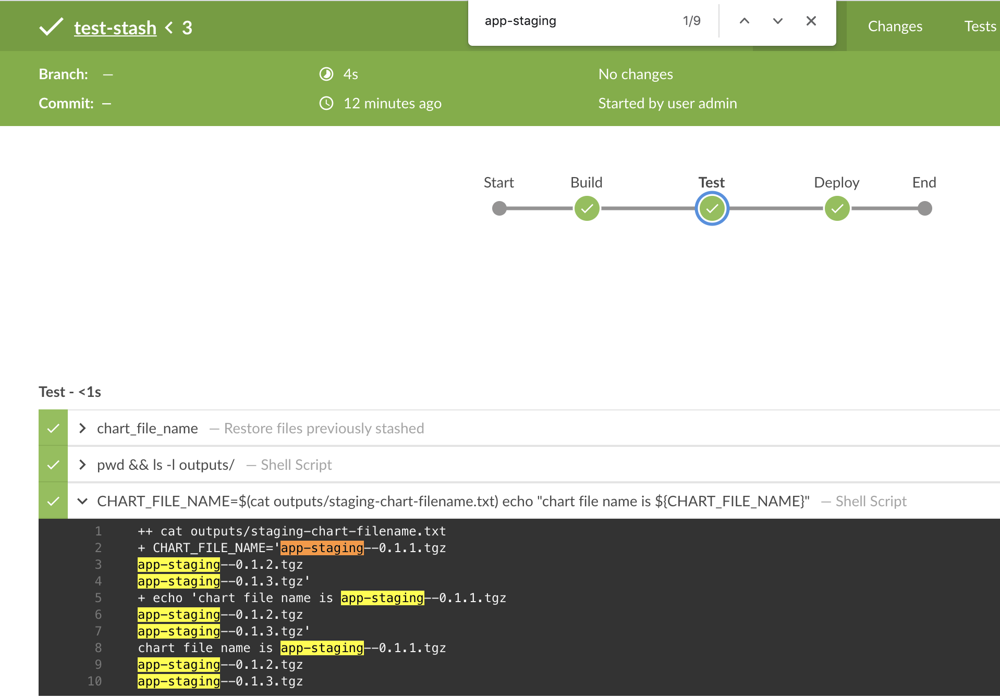


## 11.10 Short hand function syntax
Ref: https://www.jenkins.io/doc/book/pipeline/jenkinsfile/#optional-step-arguments

You can ommit ([]) to function call
```sh
git([url: 'git://example.com/amazing-project.git', branch: 'master'])

# same as
git url: 'git://example.com/amazing-project.git', branch: 'master'
```

```sh
# short form
sh 'echo hello'

# long form
sh([script: 'echo hello']) 
```

Example for `sh()`
```groovy
pipeline {
    agent any
    stages {
        stage(" sh()") {
            steps {
                // short form 
                sh 'echo hello'

                // long form
                sh([script: 'echo hello'])
            }
        }
    }
}
```

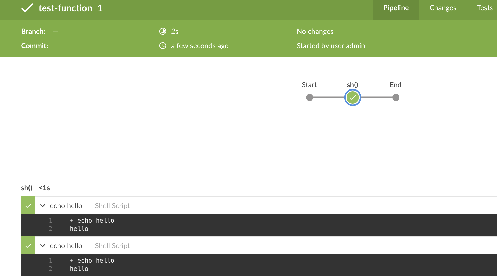

Another example for `git()`
```groovy
pipeline {
    agent any
    stages {
        stage(" git()") {
            steps {
                // need ssh key for private repo. Ref: https://www.jenkins.io/doc/book/pipeline/jenkinsfile/#for-other-credential-types
                withCredentials([ 
                                sshUserPrivateKey(credentialsId: "bitbucket", // value of this field is the credential ID stored in Jenkins
                                keyFileVariable: 'bitbucket_ssh_key') // name of the environment variable that will be bound to these credentials
                                ]) {

                    // short form 
                    git branch: 'master',
                        credentialsId: 'bitbucket', // using private ssh key
                        url: "${PRIVATE_REPO_URL}"

                    // long form
                    git([branch: 'master',
                        credentialsId: 'bitbucket', // using private ssh key
                        url: "${PRIVATE_REPO_URL}"])
                } // withCredentials
            } // steps
        } // stage
    } // stages
} // pipeline
```


## 11.11 Multibranch Jenkins Pipeline

Ref: https://www.jenkins.io/doc/book/pipeline/multibranch/#creating-a-multibranch-pipeline

The __Multibranch Pipeline__ project type enables you to implement different Jenkinsfiles for different branches, or just one Jenkinsfile across different branches.

In a Multibranch Pipeline project, Jenkins automatically discovers, manages and executes Pipelines for branches which contain a Jenkinsfile in source control.


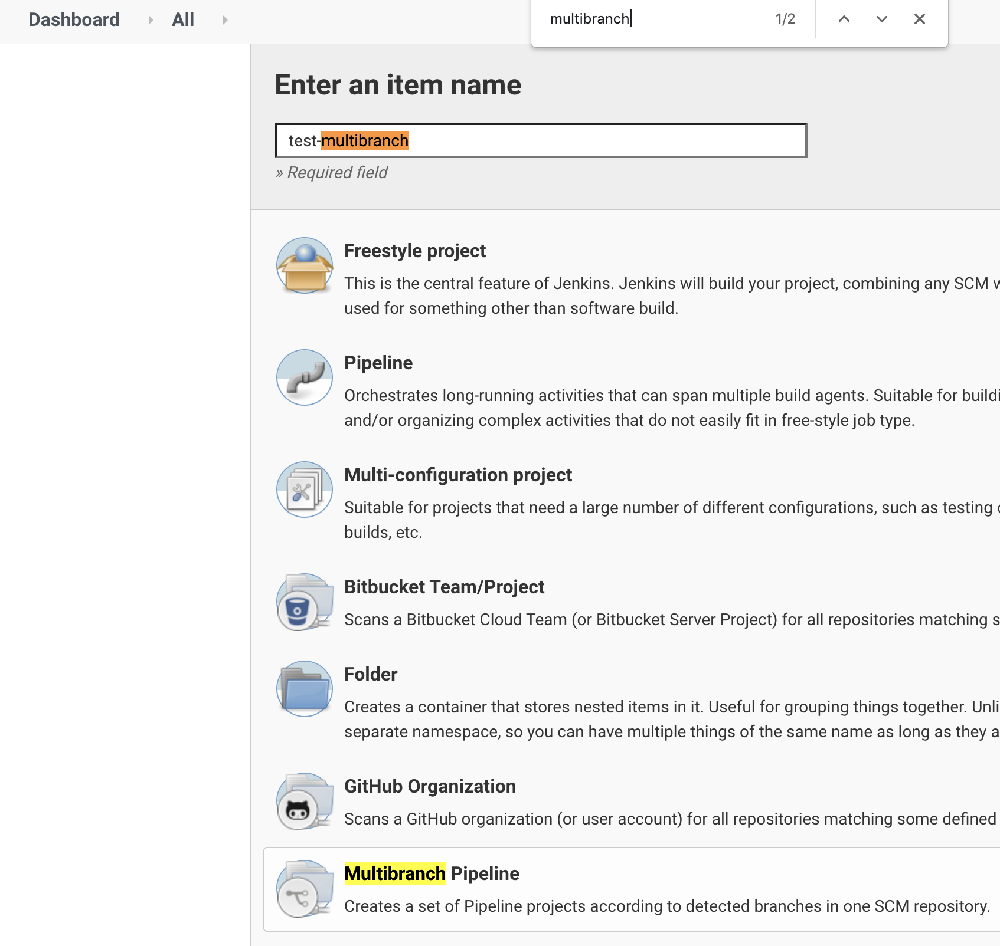


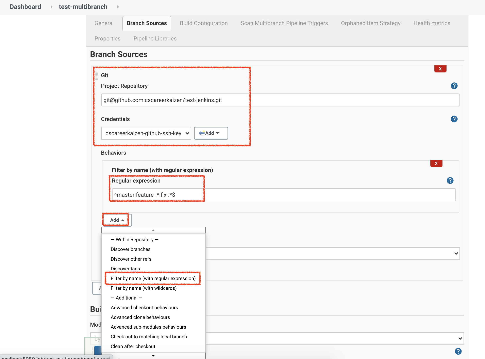


## (Advanced) 11.12 Use Docker as Execution Environment
Refs: 
- https://www.jenkins.io/doc/book/pipeline/docker/
- https://www.jenkins.io/doc/book/pipeline/docker/#specifying-a-docker-label


### 11.12.1 Install Docker on Amazon Linux 2
Ref: https://docs.aws.amazon.com/AmazonECS/latest/developerguide/docker-basics.html

Otherwise fails with `jenkins pipeline docker: command not found` error later.
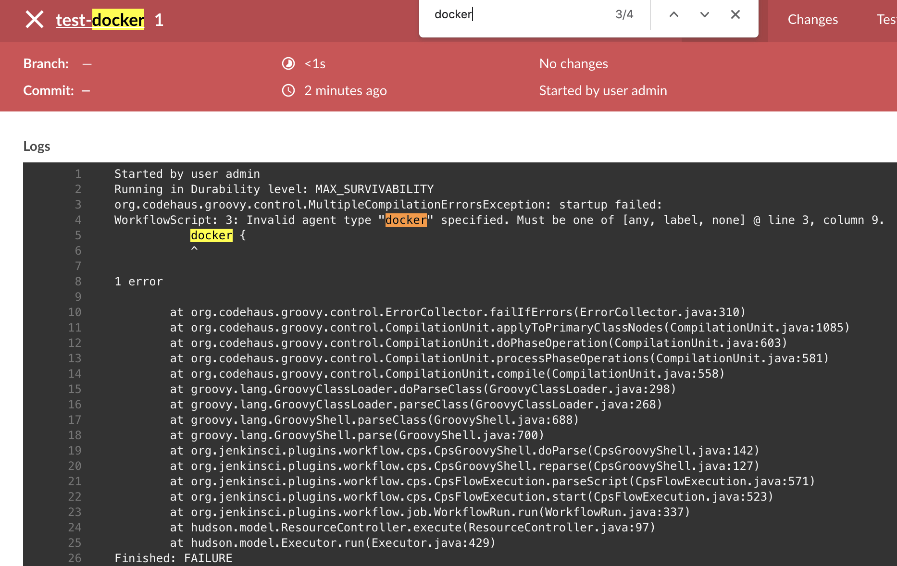

```sh
# ssh into test-jenkins EC2 in public subnet
ssh -A ec2-user@PUBLIC_IP

sudo yum update -y
sudo rm /etc/yum.repos.d/docker-ce.repo # ref: https://stackoverflow.com/questions/60690568/unable-to-install-docker-on-aws-linux-ami
sudo amazon-linux-extras install docker -y
sudo service docker start
```

If you don't add `jenkins` user to `docker` group, you will face permissions error when testing connection. 

(Ref: https://stackoverflow.com/questions/47854463/docker-got-permission-denied-while-trying-to-connect-to-the-docker-daemon-socke)
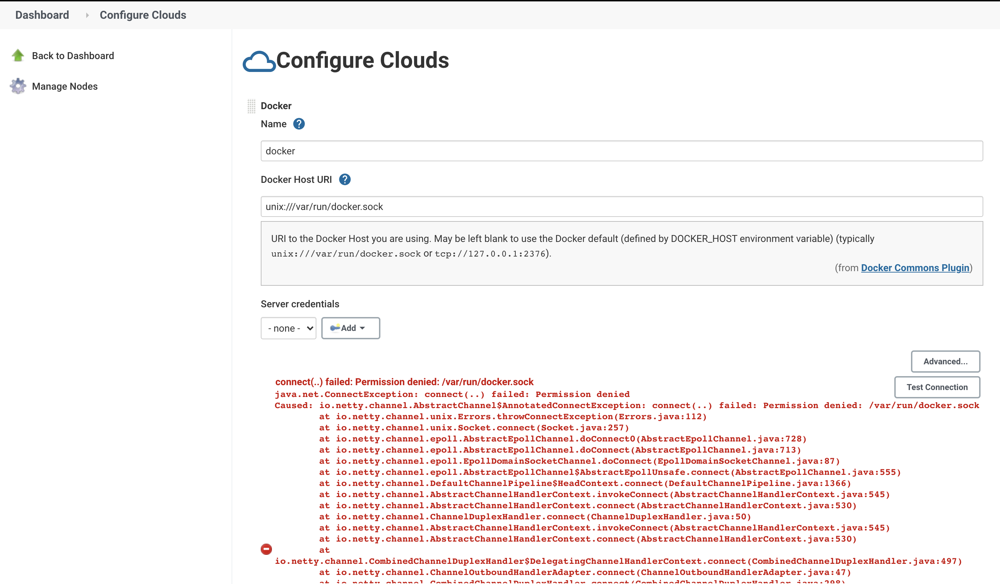

```sh
# add jenkins to docker group
sudo usermod -a -G docker ec2-user 
sudo usermod -a -G docker jenkins

ls -al /var/run/docker.sock

# or just access PUBLIC_IP:8080/restart
sudo service jenkins restart

docker
```

#### NOTE: if you stop and start EC2, docker daemon might not start automatically and you will get "Cannot connect to the Docker daemon at unix:///var/run/docker.sock. Is the docker daemon running?" from pipeline.

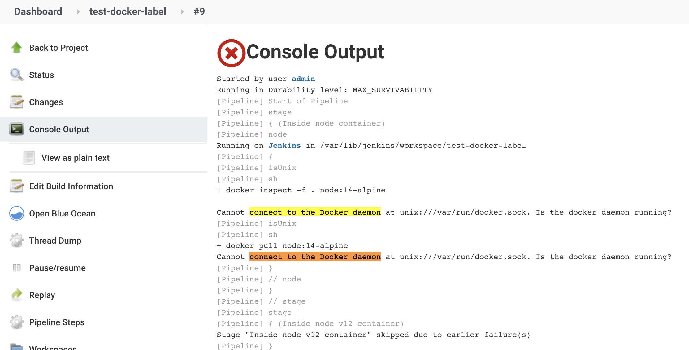

```sh
# start docker service
$ sudo service docker start
Redirecting to /bin/systemctl start docker.service

# make sure /var/run/docker.sock exists
$ ls -al /var/run/docker.sock
srw-rw---- 1 root docker 0 Sep 10 05:23 /var/run/docker.sock
```


### 11.12.2 Install Docker and Docker Pipeline plugins

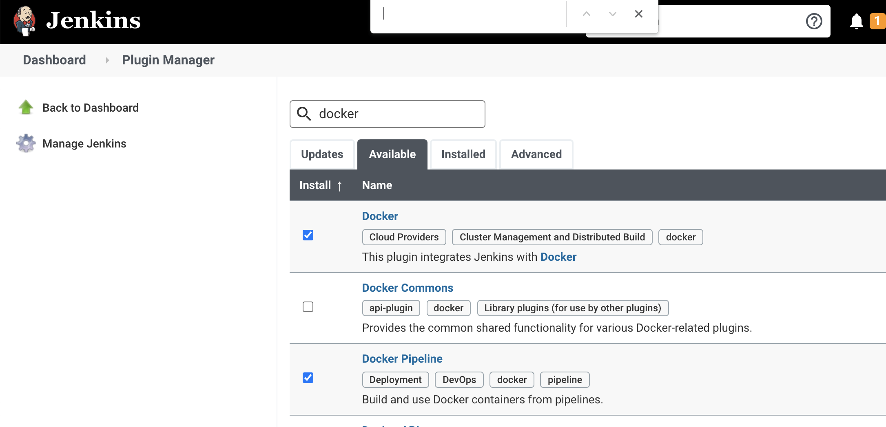


__**NOTE__: For __Mac and Windows__ user, you need to set docker binary path in `Manage Jenkins` > `Global Tool Configuration` and docker label in `Manage Jenkins` > `Configure System`. I haven't been able to get it working. Linux recommended
 (https://www.jenkins.io/doc/book/pipeline/docker/#specifying-a-docker-label)


### 11.12.3 Configure Cloud for Docker Plugin

`Manage Jenkins` > `Manage Nodes and Clouds` > `Configure Cloud`

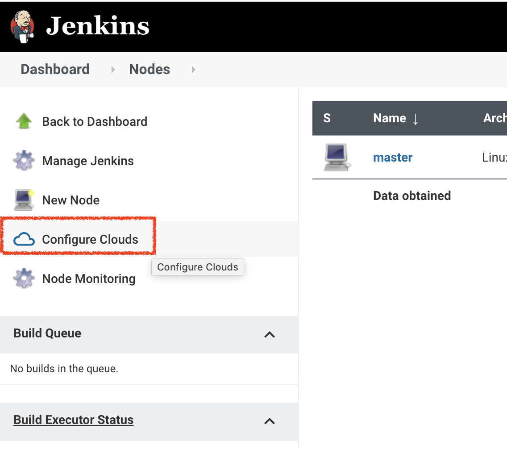

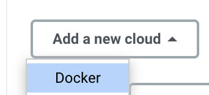

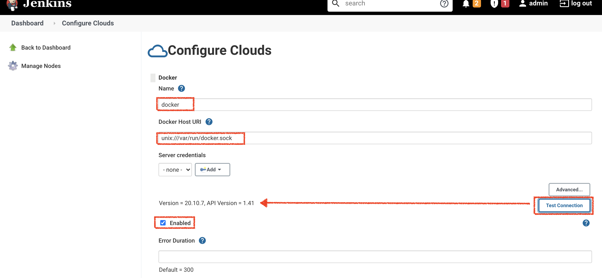


### 11.12.4 Configure Master Node

`Manage Jenkins` > `Manage Nodes and Clouds` > Setting Icon

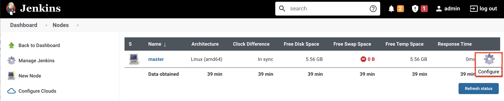
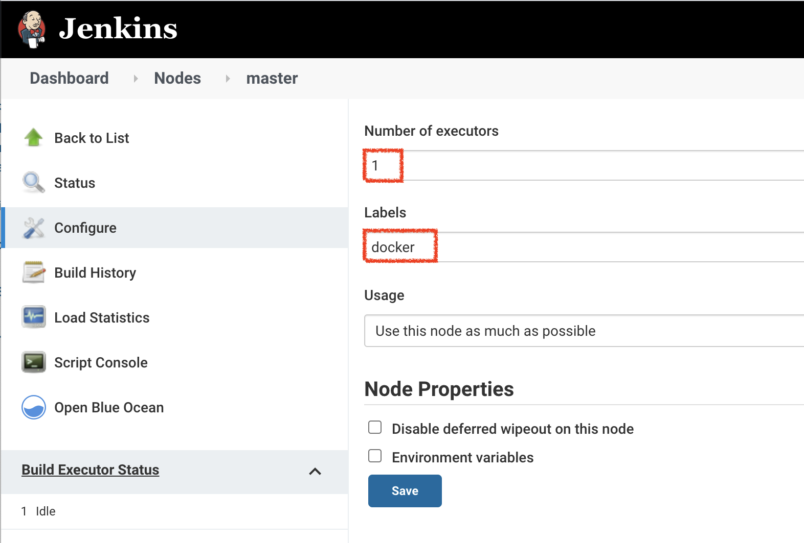


### 11.12.5 Configure Jenkins Pipline using Jenkinsfile, specify docker as agent

You can use one docker image for entire pipeline

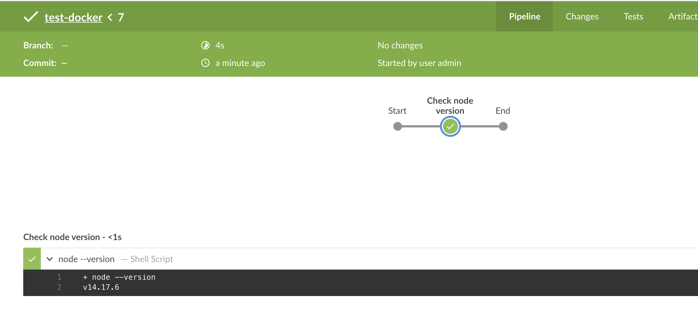

```groovy
pipeline {
    agent {
        docker { // entire pipeline will be run in node container
            image 'node:14-alpine' 
        }
    }
    stages {
        stage('Check node version') {
            steps {
                sh 'node --version'
            }
        }
    }
}
```

Or you can use __multiple docker images__ for different stages
```groovy
pipeline {
    agent none
    stages {
        stage('Inside node container') {
            agent {
                docker {  
                  image 'node:14-alpine'
                }
            }
            steps {
                sh 'node --version'
            }
        }

        stage('Inside node v12 container') {
            agent {
                docker {   
                  image 'node:12-alpine'
                }
            }
            steps {
                sh 'node --version'
            }
        }
    }
}
```

or using label
```groovy
pipeline {
    agent {
        label 'docker'
    }
    stages {
        stage('Inside node container') {
            agent {
                docker {   // both label and image
                  label 'docker'  <--------------------
                  image 'node:14-alpine'
                }
            }
            steps {
                sh 'node --version'
            }
        }

        stage('Inside node v12 container') {
            agent {
                docker {   // both label and image
                  label 'docker'
                  image 'node:12-alpine'
                }
            }
            steps {
                sh 'node --version'
            }
        }
    }
}
```


### 11.12.6 Caching/Sharing Data between Pipelines or Stages

Ref: https://www.jenkins.io/doc/book/pipeline/docker/#caching-data-for-containers

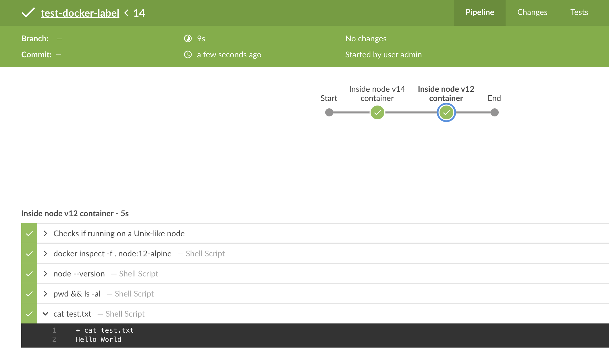

```groovy
pipeline {
    agent none
    stages {
        stage('Inside node v14 container') {
            agent {
                docker {  
                  image 'node:14-alpine'
                  args '-v $HOME/test.txt:/root/test.txt' // <------- this
                }
            }
            steps {
                sh 'node --version'

                sh 'echo "Hello World" > test.txt'
            }
        }

        stage('Inside node v12 container') {
            agent {
                docker {   
                  image 'node:12-alpine'
                  args '-v $HOME/test.txt:/root/test.txt' // you can mount volume to share storage across stages or pipelines
                }
            }
            steps {
                sh 'node --version'

                sh 'pwd && ls -al'
                sh 'cat test.txt'
            }
        }
    }
}
```


## 11.13 Parallel Execution in Pipeline
Ref: https://www.jenkins.io/doc/book/pipeline/syntax/#parallel

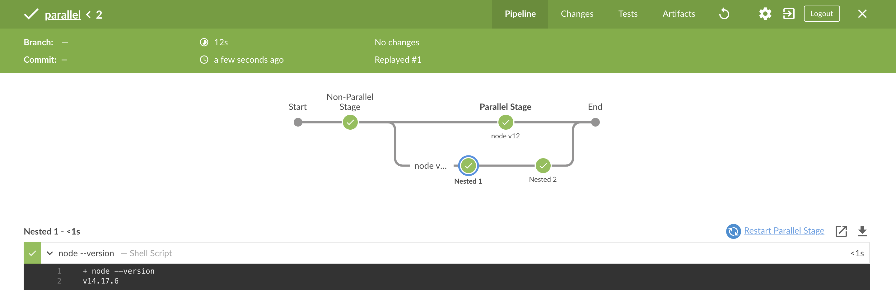

```groovy
pipeline {
    agent any
    stages {
        stage('Non-Parallel Stage') {
            steps {
                echo 'This stage will be executed first.'
            }
        }
        stage('Parallel Stage') {
            failFast true
            parallel {
                stage('node v12') {
                    agent {
                        docker {   
                            image 'node:12-alpine'
                        }
                    }
                    steps {
                        sh 'node --version'
                    }
                }
                stage('node v14') {
                    agent {
                         docker {   
                            image 'node:14-alpine'
                        }
                    }
                    stages {
                        stage('Nested 1') {
                            steps {
                                sh 'node --version'
                            }
                        }
                        stage('Nested 2') {
                            steps {
                                sh 'node --version'
                            }
                        }
                    } // nested stages
                } // parallel stage
            } // parallel
        } // stage
    } // stages
}
```


## 11.14 Scripted vs Declarative Jenkins pipeline in Jenkinsfile (IaC vs Console)

## scripted vs declarative: 
https://courses.edx.org/courses/course-v1:LinuxFoundationX+LFS167x+2T2020/courseware/4af6ac40b30c4d1f8e40bea7c6bbf6bd/59fa2569944041018079fec32c79ca4b/?child=last

Pipeline is a new Jenkins job type and a new way to model and visualize CI/CD workflow for a project. It is created by writing a bunch of instructions in a file called Jenkinsfile. The Jenkins Pipeline uses a domain-specific language based on Apache Groovy to create, edit, view, and run CD pipelines.


A Jenkinsfile can use either of the following two syntaxes:

- __Declarative Pipelines__
They require the Blue Ocean plugin to be installed. You can easily create your Jenkinsfile using the Blue Ocean graphical pipeline editor. It also provides you with a great visualization of your pipeline runs.

- __Scripted Pipelines__
With scripted pipelines, you have the option of creating the Jenkinsfile using the classic Jenkins UI. This means you will be creating the Jenkins job using the Pipeline job type. While scripted pipelines offer a lot of flexibility, they also require you to have a knowledge of Apache Groovy.

It is worth noting that there is a lot of commonality in the syntactical components between declarative and scripted pipelines.

It is best to start out with declarative pipelines, and as you get comfortable with them, you can move on to scripted pipelines. For the remainder of this chapter, we will focus on declarative pipelines.

- https://www.youtube.com/watch?v=7KCS70sCoK0&t=50s
- https://www.youtube.com/watch?v=-GsvomI4CCQ
- https://e.printstacktrace.blog/jenkins-scripted-pipeline-vs-declarative-pipeline-the-4-practical-differences/
 
