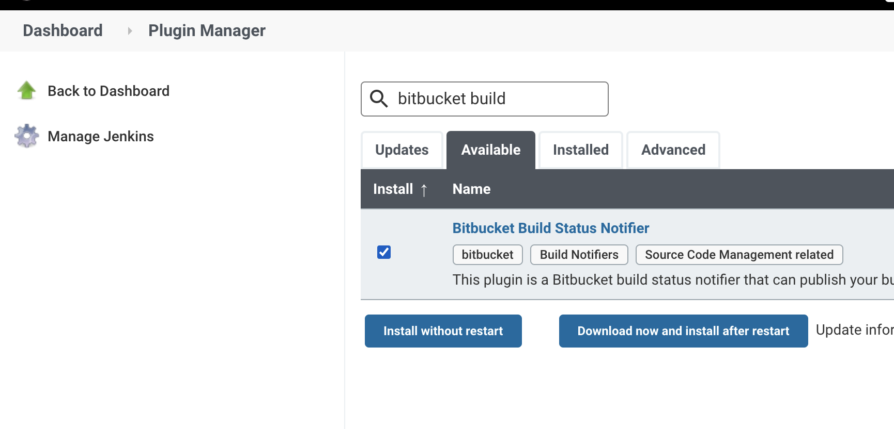

# 12. (Advanced) (Coding Challenge) Coding Jenkinsfile with Bitbucket integration

Since Jenkins master is running on EC2 and we are not using K8s yet, this is a scenario where apps are deployed as processes instead of docker container.

There are a few ways to deploy app:
1. (__mutable and downtime__, least desided) Jenkins ssh into a server, copy artifacts to server directory, and restart a process (i.e. `forever restart`)
2. (__mutable and zero-downtime with rolling upgrade__, not best practice but better than #1) Jenkins finishes CI part, upoad artifacts to S3, then setup CloudWatch Event to trigger CodeDeploy to do rolling upgrade of artifacts to EC2s in ASG one at a time
3. (__immutable and zero-downtime with rolling upgrade__, better than #2 but still takes more time to build AMI than docker image) Jenkins will create a machine image (i.e. AWS EC2's AMI) using Packer, bake artifacts into new AMI, and upload new AMI to S3 bucket. Then setup ASG lifecycle hooks to trigger rolling out new EC2 based on new AMI.

None of the above is ideal and they are obsolete ways to architect infra and CI/CD pipeline. But since we don't use dockerlized app and K8s Helm rolling upgrade until next `Advanced Jenkins in K8s (DinD: Docker in Docker)` course, let's create Jenkinsfile to do CI part (pull, build, test, pacakge artifact).


## 12.1 How to pull from private Bitbucket repo

First install Bitbucket (and git) plugin


Upload __public__ ssh key to your bitbucket 


Create Jenkins Credentials by uploading __private__ ssh key


[Jenkinsfile.clone](Jenkinsfile.clone):
```groovy
#!/usr/bin/env groovy

pipeline {
    agent any

    environment {
        GIT_URL_TEST_JENKINS = "git@github.com:cscareerkaizen/test-jenkins.git"
        GIT_URL_TEST_JENKINS_BITBUCKET = "git@bitbucket.org:cscareerkaizen/test-jenkins-bitbucket.git"
    }

    options {
        timeout(time: 30, unit: 'MINUTES') // timeout plugin
        retry(1)
    }

    stages {
        stage("Clone Private Repo") {
            steps {
                withCredentials([ // need ssh key for private Bitbucket
                                sshUserPrivateKey(credentialsId: "bitbucket_ssh_key",
                                keyFileVariable: 'bitbucket_ssh_key')
                                ]) {

                    // given that this jenkinsfile is at github repo, we want to pull from bitbucket repo
                    git branch: 'master',
                        credentialsId: 'bitbucket_ssh_key',
                        url: "${GIT_URL_TEST_JENKINS_BITBUCKET}"

                        sh '''
                            pwd
                            ls -al
                        '''
                  } // withCredentials
              } // steps
          }  // stage   
    } // stages
} // pipeline
```


## 12.2 How to enable timestamps in logs locally or globally

Install `timestamper` plugin


### Locally per Pipeline

Add `timestamps()` to `options{}` block
```groovy
pipeline {
    agent any

    options {
        timestamps() // Prepend all console output generated during this stage with the time at which the line was emitted
    }
}
```

### Globally (all pipelines)

`Manage Jenkins` > `Configure System`


Now logs will have timestamps:


## 12.3 How to build Docker image in Declarative Jenkins Pipeline

Go to your private bitbucket directory, then clone public `example-voting-app` repo.

```sh
$ ls
test-jenkins-bitbucket

$ cd test-jenkins-bitbucket/

$ git clone https://github.com/dockersamples/example-voting-app.git
Cloning into 'example-voting-app'...
remote: Enumerating objects: 971, done.
remote: Total 971 (delta 0), reused 0 (delta 0), pack-reused 971
Receiving objects: 100% (971/971), 980.92 KiB | 3.76 MiB/s, done.
Resolving deltas: 100% (365/365), done.

$ git add example-voting-app/

$ git commit -m "Clone example-voting-app repo"

$ git push
```


Then add this block to Jenkinsfile

[Jenkinsfile.build](Jenkinsfile.build):
```groovy
pipeline {
    stages {
        .
        .
        .
        stage('Build Docker Image') {
            steps {
                sh '''
                    docker version
                    pwd
                    cd example-voting-app/result
                    ls -al

                    echo "Building docker image..."

                    # get first 20 chars because k8s name should be no more than 63 characters
                    # prepend shortened branch name to image tag as later stage can only fetch shortened branch name from git tag
                    # NOTE: BRANCH_NAME is only available if using multibranch pipeline
                    short_branch_name=$(echo ${BRANCH_NAME} | cut -c1-20)
                    echo "short_branch_name = ${short_branch_name}"

                    DOCKER_BUILDKIT=1 docker build \
                        --tag "\${ECR}/\${IMAGE}:${short_branch_name}_0.1.$BUILD_NUMBER" \
                        --progress plain \
                        --file Dockerfile .

                    echo "Listing docker images after finishing 'docker build'..."
                    docker images
                '''
            } // steps
        } // stage 
    }
}
```


## 12.4 How to push Docker Image to AWS ECR in Declarative Jenkins Pipeline

First, create IAM role for EC2 which contains ECR permissions:


Then attach instance profile to EC2:


Check if EC2 is associated with the right instance profile
```sh
[ec2-user@ip-xx-xx-xx-xx ~]$ curl http://169.254.169.254/latest/meta-data/iam/info

{
  "Code" : "Success",
  "LastUpdated" : "2021-09-10T12:00:16Z",
  "InstanceProfileArn" : "arn:aws:iam::266981300450:instance-profile/JenkinsECRRole", # <------ JenkinsECRRole is attached
  "InstanceProfileId" : "AIPAT4KKTLDRPG5EDM6E6"
}
```

Test authentication to AWS ECR
```sh
# change this to your region
AWS_REGION="ap-southeast-1"
ecr_password=$(aws ecr get-login-password --region ${AWS_REGION})

# change to your ECR repo URI
ECR="266981300450.dkr.ecr.ap-southeast-1.amazonaws.com/test-jenkins"
echo ${ecr_password} | docker login \
        --username AWS \
        --password-stdin \
        ${ECR}

# successful output after login
Login Succeeded
```

Create private AWS ECR repo called `ecr-voting-app`


Then create a pipeline using [Jenkinsfile.upload](Jenkinsfile.upload):
```groovy
#!/usr/bin/env groovy

pipeline {
    agent any

    environment {
        GIT_URL_TEST_JENKINS = "git@github.com:cscareerkaizen/test-jenkins.git"
        GIT_URL_TEST_JENKINS_BITBUCKET = "git@bitbucket.org:cscareerkaizen/test-jenkins-bitbucket.git"

        ECR = "266981300450.dkr.ecr.ap-southeast-1.amazonaws.com" // set to your own ECR URI
        AWS_REGION = "ap-southeast-1" // set to your AWS region
        IMAGE = "ecr-voting-app"
    }

    options {
        timeout(time: 30, unit: 'MINUTES') // timeout plugin
        retry(1)
        timestamps() // Prepend all console output generated during this stage with the time at which the line was emitted
    }

    stages {
        stage("Clone Private Repo") {
            steps {
                withCredentials([ // need ssh key for private Bitbucket
                                sshUserPrivateKey(credentialsId: "bitbucket_ssh_key",
                                keyFileVariable: 'bitbucket_ssh_key')
                                ]) {

                    // given that this jenkinsfile is at github repo, we want to pull from bitbucket repo
                    git branch: 'master',
                        credentialsId: 'bitbucket_ssh_key',
                        url: "${GIT_URL_TEST_JENKINS_BITBUCKET}"

                        sh '''
                            pwd
                            ls -al
                        '''
                } // withCredentials
            } // steps
        }  // stage  

        stage('Build Docker Image') {
            steps {
                sh '''
                    docker version
                    pwd
                    cd example-voting-app/result
                    ls -al

                    echo "Building docker image..."

                    # get first 20 chars because k8s name should be no more than 63 characters
                    # prepend shortened branch name to image tag as later stage can only fetch shortened branch name from git tag
                    # NOTE: BRANCH_NAME is only available if using multibranch pipeline
                    short_branch_name=$(echo ${BRANCH_NAME} | cut -c1-20)
                    echo "short_branch_name = ${short_branch_name}"

                    DOCKER_BUILDKIT=1 docker build \
                        --tag "\${ECR}/\${IMAGE}:${short_branch_name}_0.1.$BUILD_NUMBER" \
                        --progress plain \
                        --file Dockerfile .

                    echo "Listing docker images after finishing 'docker build'..."
                    docker images
                '''
            } // steps
        } // stage 

        stage('Push Docker Image to ECR') {
            steps {
                // can't use docker pipeline plugin's docker.withRegistry() for push as we get AWS temp creds from IAM instance profile
                sh'''
                    # check identity
                    aws sts get-caller-identity

                    # hide creds from console
                    set +x
                    set -o verbose

                    # get ecr password
                    ecr_password=$(aws ecr get-login-password --region ${AWS_REGION})

                    # login to ecr repo using docker login
                    echo ${ecr_password} | docker login \
                                                      --username AWS \
                                                      --password-stdin \
                                                      ${ECR}

                    # enbale back
                    set -o xtrace
                    set +v

                    docker images

                    # get first 20 chars because k8s name should be no more than 63 characters
                    # prepend shortened branch name to image tag as later stage can only fetch shortened branch name from git tag
                    short_branch_name=$(echo ${BRANCH_NAME} | cut -c1-20)

                    # push
                    docker push "${ECR}/${IMAGE}:${short_branch_name}_0.1.$BUILD_NUMBER"
                '''
            } // steps
        } // strage
    } // stages
} // pipeline
```

Image is pushed to ECR after.


## 12.5 How to Trigger Jenkins Pipeline Build from Bitbucket Webhooks

Ref: https://github.com/jenkinsci/bitbucket-plugin#bitbucket-cloud-usage


### 12.5.1 Configure Bitbucket Cloud repo's webhooks

URL must be `PUBLIC_JENKINS_ENDPOINT:8080/bitbucket-hook/` (with a trailing /).


### 12.5.2 Add bitbucketPush() to triggers {} in Jenkinsfile 

```groovy
#!/usr/bin/env groovy

pipeline {
    agent any

    triggers {
        bitbucketPush()
    }
}
```


### 12.5.3 Push Jenkinsfile at the root of the repo

Then commit Jenkinsfile to the root of the repo.

```sh
$ pwd
test-jenkins-bitbucket/

$ ls
Jenkinsfile             README.md               example-voting-app

$ git add Jenkinsfile 
$ git commit -m "Add Jenkisfile"
$ git push
```


### 12.5.4 Manually Create Jenkins Multibranch Pipeline on GUI

Make sure to select `git` as Branch Source.

(__WARNING__: Bitbucket Branch Source plugin doesn't work with SSH key for multibranch pipeline, despite some attempts [here](https://www.youtube.com/watch?v=LNfthmZuRDI&ab_channel=CloudBeesTV) and [here](https://github.com/jenkinsci/bitbucket-branch-source-plugin/blob/master/docs/USER_GUIDE.adoc). You can use username/password to connect to bitbucket repo, but SSH key is preferred.)


### 12.5.5 Commit something and see webhook request is okay

Should get 200 response code from `PUBLIC_JENKINS_ENDPOINT:8080/bitbucket-hook/`:


## 12.6 How to Push Build Status to Bitbucket

## 12.6.1 Install Bitbucket Build Status Notifier Plugin
First install [bitbucket-build-status-notifier](https://plugins.jenkins.io/bitbucket-build-status-notifier/) plugin.




## 12.6.2 Create Bitbucket OAuth Consumer Key and Secret
Ref: https://github.com/jenkinsci/bitbucket-build-status-notifier-plugin#create-a-oauth-consumer


Callback URL and URL fields can be any dummy values.


## 12.6.3 Save the Bitbucket OAuth Consumer Key and Secret as Jenkins Credentials (Username with password)

Manage Jenkins > Manage Credentials > Create Username with password and enter the OAuth consumer key and secret


## 12.6.4 Configure Jenkins URL (IMPORTANT!)

`Manage Jenkins` > `Configure System` > `Jenkins Location: Jenkins URL`

Set it to __publicly accessible DNS__ (i.e. public IP of Jenkins server (not recommended and used for demo only), public DNS of ELB, etc)


This is so that when you click a bitbucket build status icon next to a commit, you get redirected back to a specific Jenkins job.


## 12.6.5 Configure Jenkin's Bitbucket Build Status Notifier Plugin to use the credential
Ref: https://github.com/jenkinsci/bitbucket-build-status-notifier-plugin#configure-jenkins-to-notify-bitbucket-from-a-standard-build

`Manage Jenkins` > `Configure System` > `Bitbucket Build Status Notifier Plugin` > Select the username/password credential you created


## 12.6.6 Call bitbucketStatusNotify() from Jenkinsfile

Add `post {}` section to Jenkinsfile, then call `bitbucketStatusNotify()` with one of the three values, `SUCCESSFUL`, `FAILED`, and `INPROGRESS`.

[Jenkinsfile.buildStatus](Jenkinsfile.buildStatus):
```groovy
pipeline {
    agent any
    stages {

    }

    post {
        success {
            // notify bitbucket
            bitbucketStatusNotify(buildState: 'SUCCESSFUL')
        }
        failure {
            bitbucketStatusNotify(buildState: 'FAILED')
        }
    } // post

} // pipeline
```


Edit Jenkinsfile, then commit
```sh
git add Jenkinsfile 
git commit -m "Add post-build action to notify status to bitbucket"
git push
```


