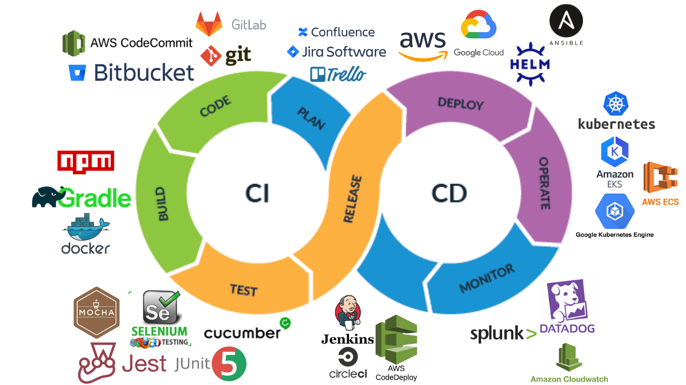
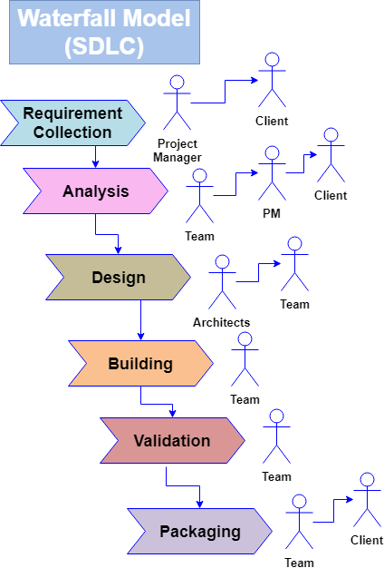
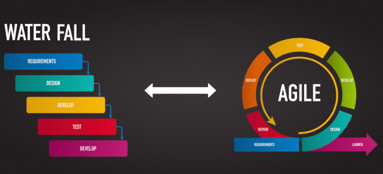
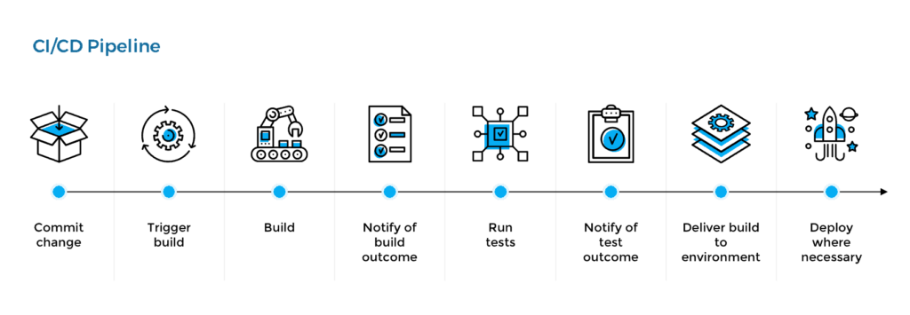
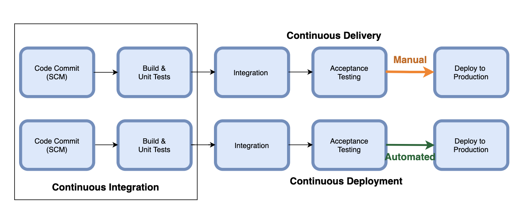
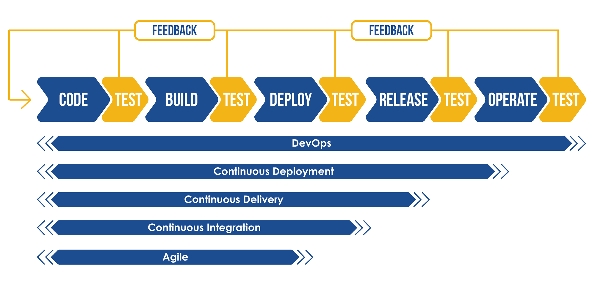

# 2. What is CI/CD Piepline

Traditionally:
- __waterfall__ (monthly or yearly release)

- different teams in silos: dev, QA, ops
- manual testing error prone

Now:
- __agile__ (daily or weekly release)

- releasing software __incrementally__
- need to integrate code from different developers on the teams -> CI
- __DevOps__: team collaboration and automation and constant feedback cycle
- CI (Continuous Integration): automated build and test for every change committed to the version control system by the developers
  - lint & format using pre-commit git hooks
  - commit to git/bitbucket
  - unit & integration test on CI server (not sufficient if the code written by a developer works only on his/her machine.)
  - feedback (Anytime a developer’s change breaks the build, they can take the necessary action )
- CD (Continuous Delivery): automatic delivery of apps to staging and prod environments (can perform push-button deployments of any version of the software to any environment on demand). (__Continuous Delivery__ gives you the capability to deploy to production frequently, it does not necessarily mean that you are automating the deployment. You may need manual approval prior to deploying to production, or your business may not want to deploy frequently)
- CICD pipeline Recap: The CI server detects the new commit, builds & compiles the code, and runs unit tests. The next stage is building & deploying the __artifacts__ (files generated from a build, or docker image, or helm chart) to staging or a feature test environment where you run additional functional, regression, and acceptance tests. Once all the tests are successful, you are ready to deploy into production

- Continuous Delivery vs Deployment

- expedite speed in software development lifecycle (SDLC) by CI & CD: commit small changes often, test everytime, fail & find bugs fast, deploy to production often
- increase software quality, development velocity, delivery speed, feedback time
