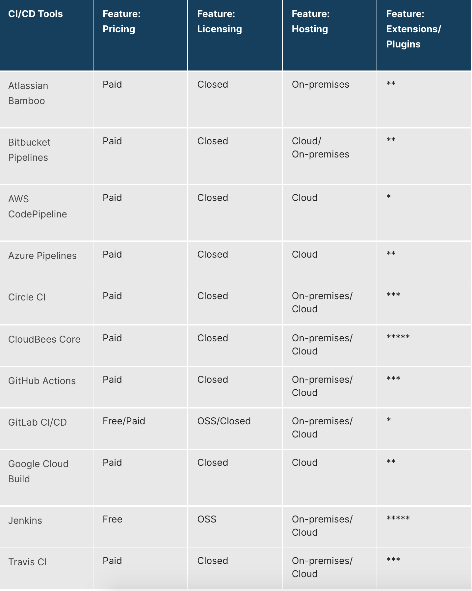

# 3. What is Jenkins CI/CD Pipeline
- free
- open source
- most widely used CI/CD for over 15 years
- flexible and comprehensive (most integrations)
- master and worker agent architecture
- shell, groovy (others like AWS CodePipeline uses YAML which is not easy to add shell commands etc)
- can be installed on Windows/Mac/Linux or as a docker container
- Java8 or Java11
- CI/CD pipeline tools comparison
