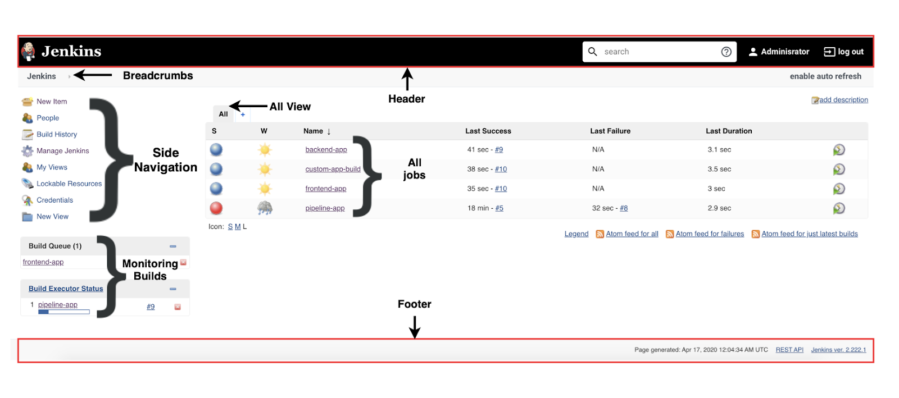

# 5. Jenkins Dashboard Overview

## 5.1 Breadcrumb

A “breadcrumb” (or “breadcrumb trail”) is a type of secondary navigation scheme that reveals the user’s location in a website or Web application.

### New Item
This is used to create new Jenkins jobs.

### People
This lets you view/modify all the user accounts that have access to the Jenkins UI.

### Build History
Clicking this will open a new subpage, which displays the build jobs, their status, and trend.

### Manage Jenkins
This is where you can perform a variety of administration tasks such as configuring Jenkins, managing plugins, configuring global tools, security, etc.

### Credentials
This option lets you centrally create and manage credentials. These credentials are used by your Jenkins instance, plugins, build jobs, etc.

## 5.2 Jenkins job

This view lists every single job that is configured on the Jenkins instance. It also displays the overall state of each Jenkins job.

### Build Status

### Build Stability

### Build Queue

The Build Queue section displays all the jobs that are currently queued and waiting for an executor to free up

### Build Executor Status
The Build Executor Status lists all the builds that are currently in progress by each configured agent

## 5.2. Quick Demo: Create & Configure Jenkins Job that pulls from Public Git and does "npm run build"

## 5.3 Plugins
## What are Plugins
Many Jenkins features such as integrating source code management tools, build tools, reporting tools, code coverage, static analysis, notifications are all implemented as plugins.

Currently, there are 1000+ plugins available for use. You can view a list of all the available plugins on the Jenkins Plugins Index page (https://plugins.jenkins.io/).

### How to install

You can easily navigate to Plugin Manager from __Jenkins > Manage Jenkins > Manage Plugins__.

You should always restart your Jenkins master after installing a new plugin by clicking Download now and install after restart. Application restart ensures all components are properly initialized.

Or you can also manually upload an .hpi or .jpi file using the upload plugin option on the __Advanced__ tab.

## How to update plugin

It is always a good practice to update the plugins frequently. New releases of plugins add enhanced functionality, security fixes, etc. Also, _older versions of plugins may not be compatible with newer versions of Jenkins core_.

### How to disable plugin

Sometimes you may not want to remove a plugin altogether, but you just want to be able to disable its functionality. You can do so on the __Installed__ tab by searching for the plugin, and unchecking the toggle under the Enabled column.

### How to uninstall
If you no longer need a plugin, you can uninstall it by selecting the specific plugin on the __Installed__ tab and clicking the Uninstall button.
