# 7. Jenkins Security
Ref: https://www.jenkins.io/doc/book/security/

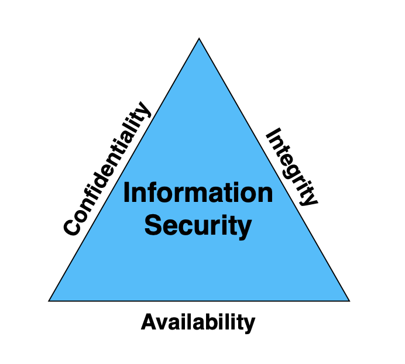

Your Jenkins server hosts your organizational intellectual property (IP) such as your source code, build artifacts, etc. Confidentiality, availability, and integrity, also known as the CIA triad, are the fundamental principles of information security.

- Confidentiality determines the secrecy of your IP, and prevents unauthorized access to restricted data.
- Integrity ensures that your IP is accurate and reliable, and it has not been modified from its original state while in transit or at rest.
- Availability is the ability of the users to access your IP. Information is of no use if it cannot be accessed.

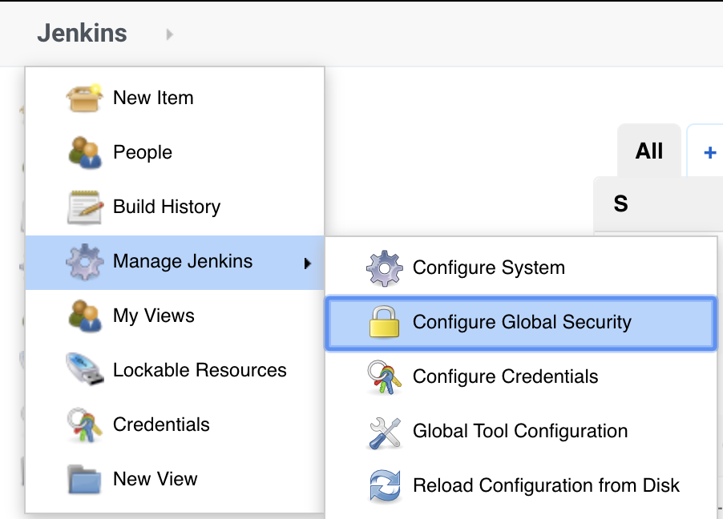
__Jenkins > Manage Jenkins > Configure Global Security__

## 7.1 CSRF Protection
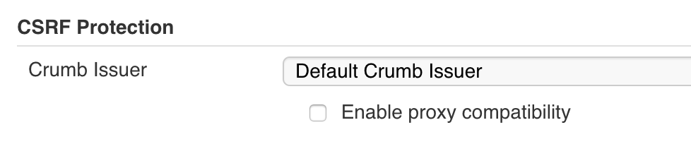

"Cross-Site Request Forgery (__CSRF__) is an attack that forces an end user to execute unwanted actions on a web application in which they are currently authenticated".

Enabling CSRF protection will protect your Jenkins environment from malicious attacks.

## 7.2 Agent-to-Master Security
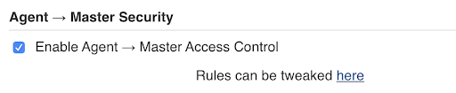

Enabling Agent > Master Access Control allows a Jenkins administrator to control what specific information is allowed by the Agents.

## 7.3 Prevent Malicious JavaScript
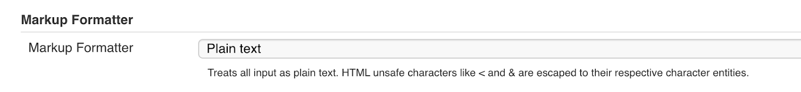
Setting the Markup Formatter to plain text by default will eliminate any unsafe HTML or JavaScript.

## 7.4 User Authentication & Authorization
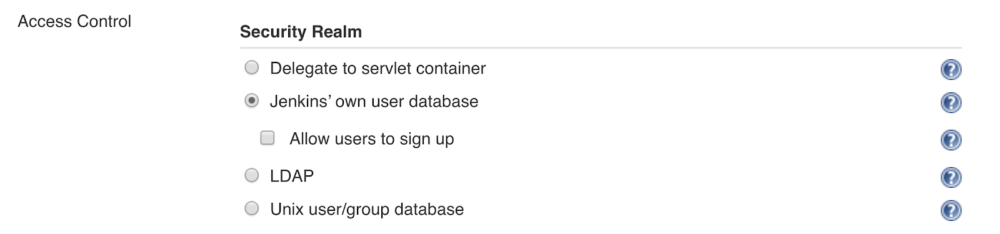

### Authentication
A __security realm__ tells Jenkins which authentication methods to use.

There are four security realms which are supported out of the box:
- Delegate to servlet container: delegates authentication to the servlet engine running Jenkins. For instance, Tomcat, JBoss, websphere, etc., have their own authentication mechanisms.
- Jenkins' own user database: enabled by default.
- LDAP: delegates authentication to an external LDAP service

There are various other security realms available through plugins such as __Github Authentication__, __Active Directory__ and __BitBucket OAuth__, to name a few. You can search these on the plugins page.

### Authorization:
- Anyone can do anything: allows both authenticated and anonymous users to do anything.
- Legacy mode: allows administrators to perform any action. All other users are restricted to read only mode.
- Logged-in users can do anything: the default authorization strategy. It allows all authenticated users to perform any action.
- __(best practice) Matrix-Based Security (using [Matrix Authorization Strategy Plugin](https://plugins.jenkins.io/matrix-auth))__: allows you to define actions allowed for each user or group globally by using a matrix

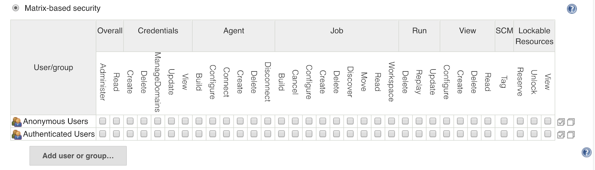

## 7.5 BEST PRACTICE DEMO: Create Jenkins user "Developer", grant him read only permissions using Role-based Authorization Strategy Plugin

### 7.5.1 Install Role-based Authorization Strategy Plugin
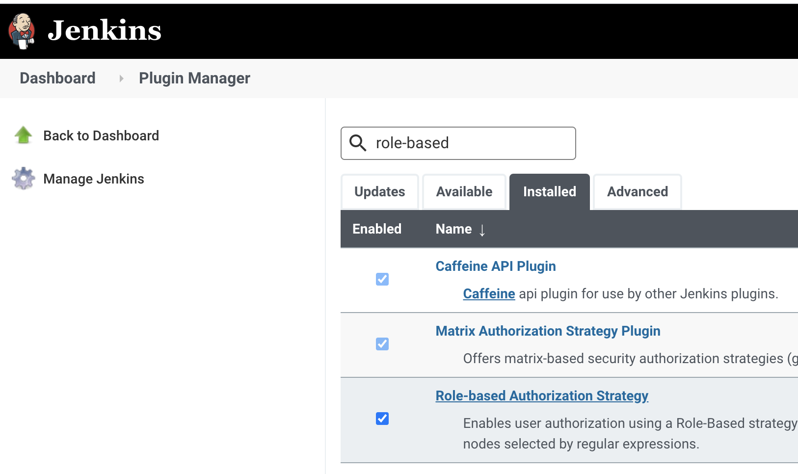

### 7.5.2 Configure Global Security by selecting role-based strategy
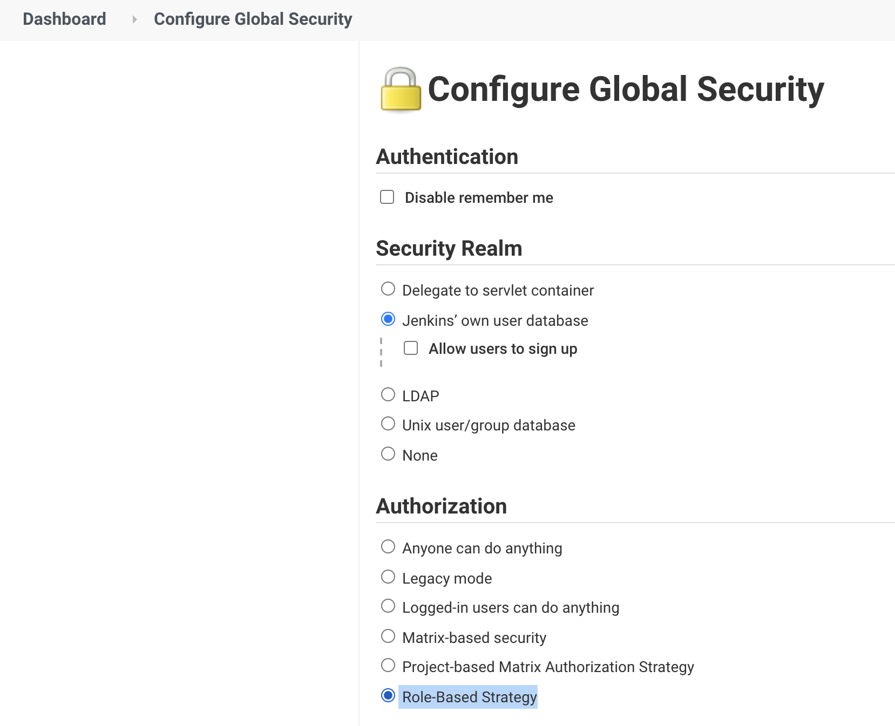

### 7.5.3 Add Jenkins User "developer"
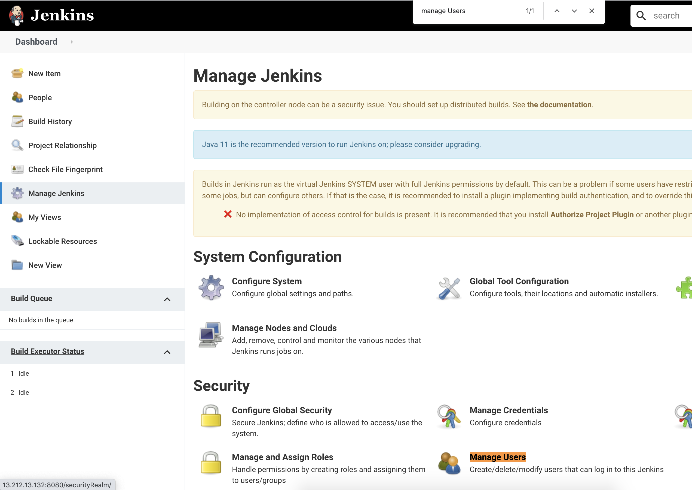
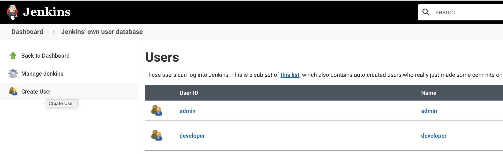

### 7.5.4 Create and Configure Developer Role

> Note: You won't see "Manage and Assign Roles" until you install __[Role-based Authorization Strategy Plugin](https://plugins.jenkins.io/role-strategy)__.

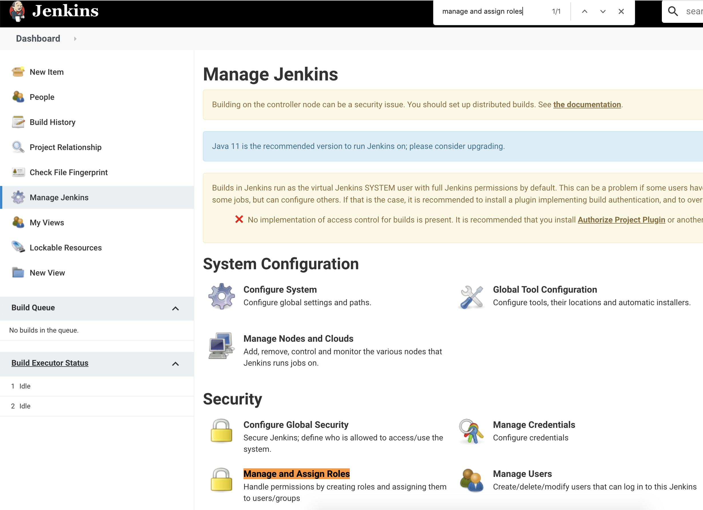
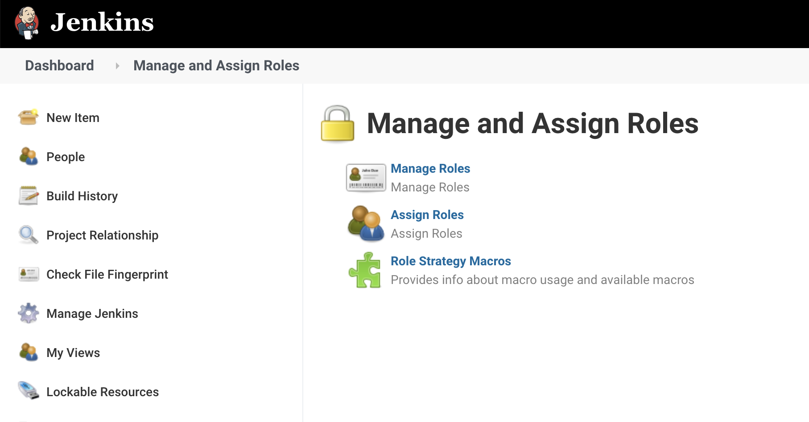
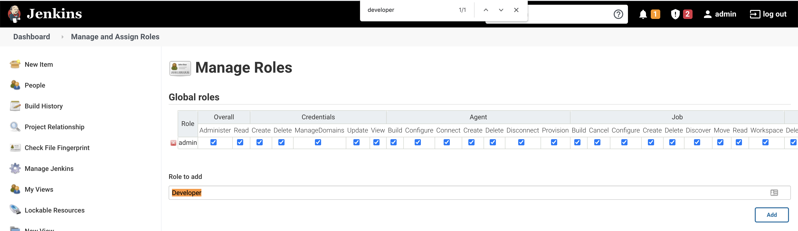
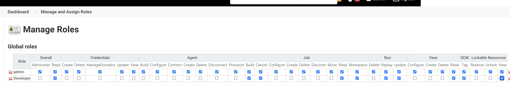

### 7.5.5 Assign Developer Role to "developer" user
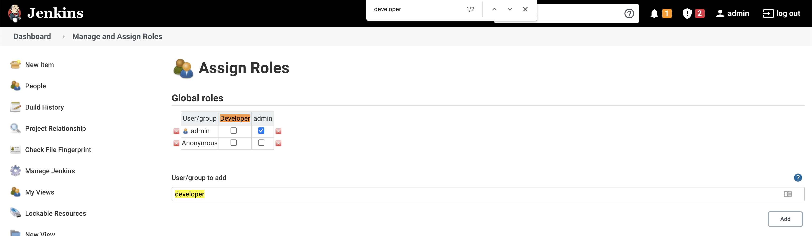
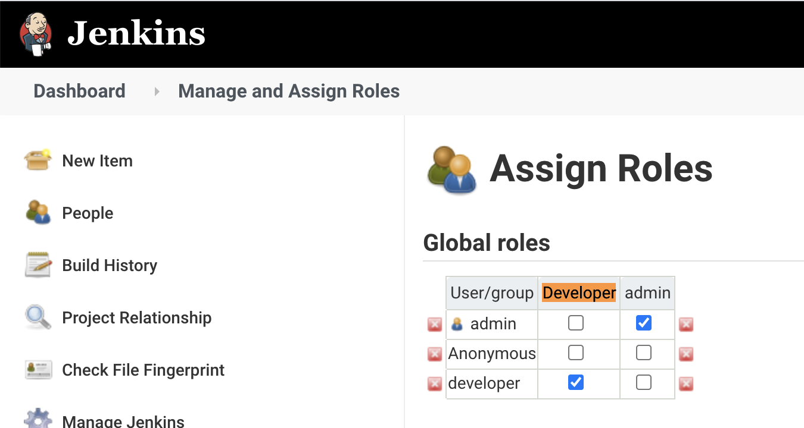

### 7.5.6 Test "developer" user not seeing "Manage Jenkins" and "Configure" Options

First login as `developer` user.

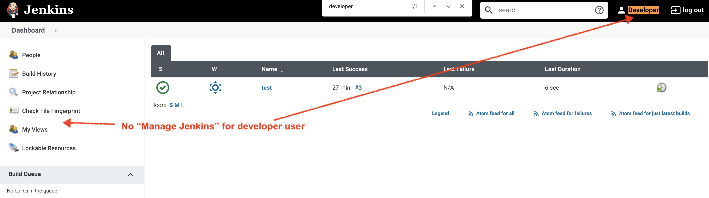
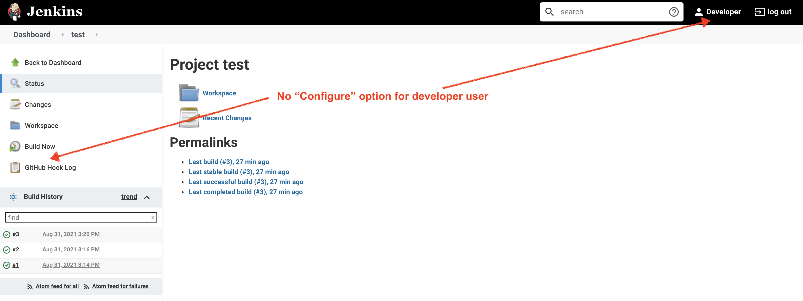

## 7.6 Credentials
- ref: https://www.jenkins.io/doc/book/using/using-credentials/
- https://youtu.be/tuxO7ZXplRE?t=308

> Note: The Jenkins credentials functionality described on this and related pages is provided by the __[Credentials Binding plugin](https://plugins.jenkins.io/credentials-binding)__.

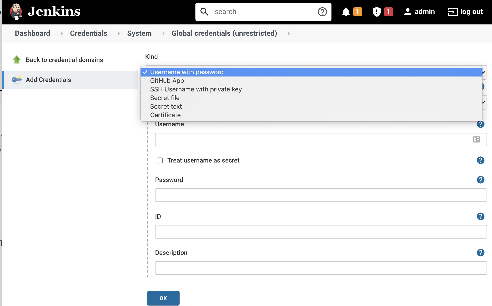

__Jenkins > Manage Jenkins > Manage Credentials__

Jenkins usually needs to authenticate itself against other services:

- SCM repositories for fetching source code (or pushing status)
- repositories for storing artifacts
- Remote secured services for authentication such as LDAP
- Deploy to secured environments (k8s cluster)

With __Credentials plugin__, you can __centrally__ manage credentials to authenticate to various services. Also credentials will be __reducted__ in Shell output automatically (vs setting credentials in environment variables in Jenkins job)

## 7.7 Demo: Create Jenkins Job that pulls from Private bitbucket using Credential (SSH)
