# 8. Jenkins freestyle job

## 8.1 Jenkins Job Overview
A Jenkins job is a sequential set of tasks that are defined by a user. Typical steps include:
- retrieving the latest source code from version control
- compiling & building any kinds of projects (__Ant, Maven, Gradle, shell script, Makefile, Docker__)
  - these tools can be configured at Global Tool Configuration page
  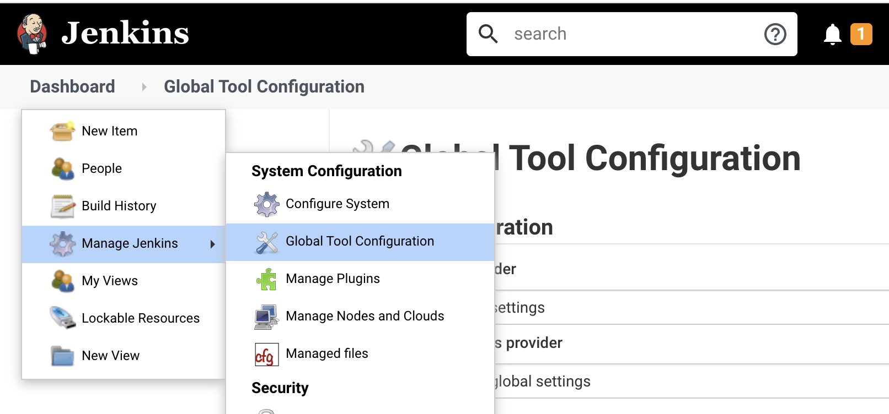
- running unit tests
- building and storing the artifacts
- notifying developers the build outcome

Many different __job types__ available in Jenkins including:
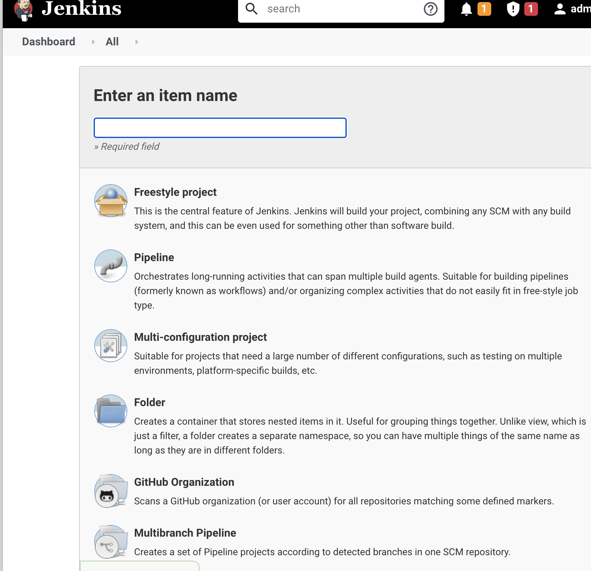

- __Freestyle Project__: the default project type, most flexible to configure, and is included as part of the core Jenkins.
- __Maven Project__: useful for building Maven projects. It requires the Maven Integration plugin to be installed.
- __Pipeline and Multibranch Pipeline__: useful for creating end-to-end CI/CD pipelines. These require __Pipeline__ and __Multibranch plugins__ to be installed.
- __External Job__: useful when you want to monitor a process that is running outside of Jenkins, and you would like to track its progress from the Jenkins dashboard.
- __Multi-Configuration Project__: useful for projects with a large number of configurations. It requires the Matrix Project plugin to be installed

## 8.2 Jenkins Job Anatomy

A Jenkins job typically includes the following __components__:
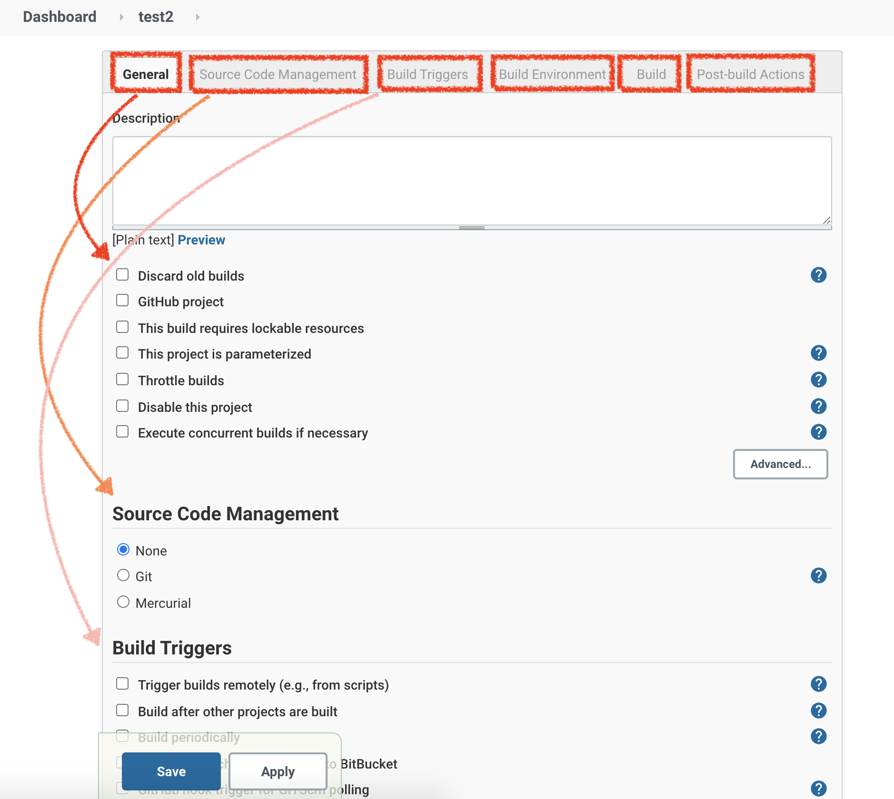
- General
  - Build history management
  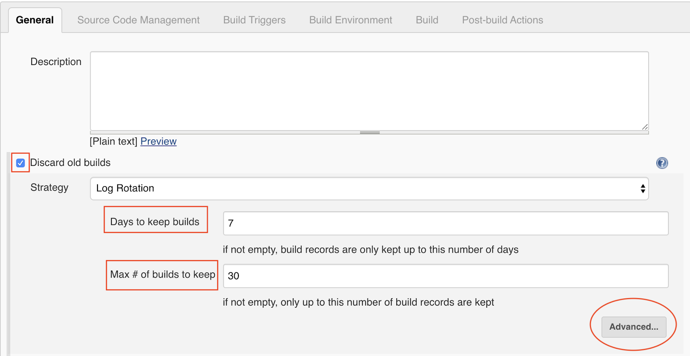
  - Build management
  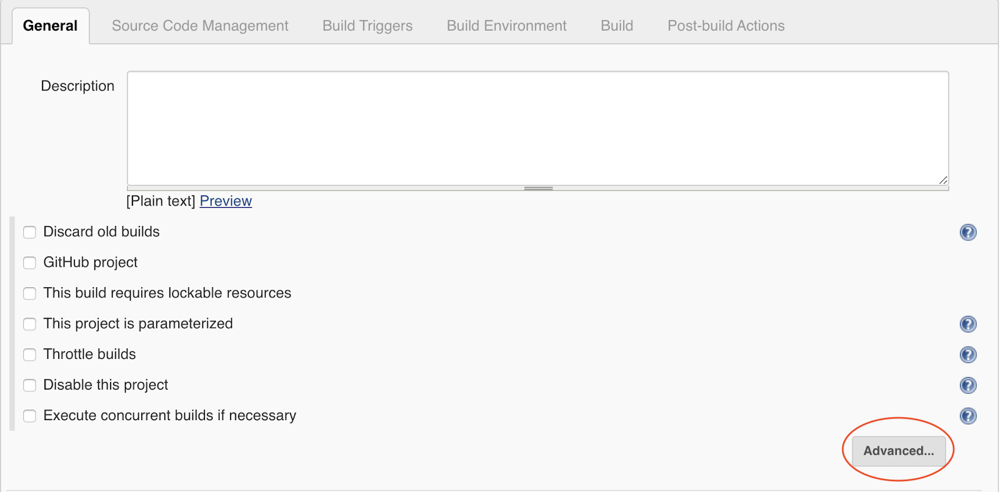
    - Quiet period: Setting a wait time between builds.
    - Retry Count: Setting a count for the number of times Jenkins will try to checkout from the configured SCM system until it succeeds.
    - Disable this project: Disable a job if you no longer need to build the job. You can enable it if needed at a later time.
- Source Code Management
  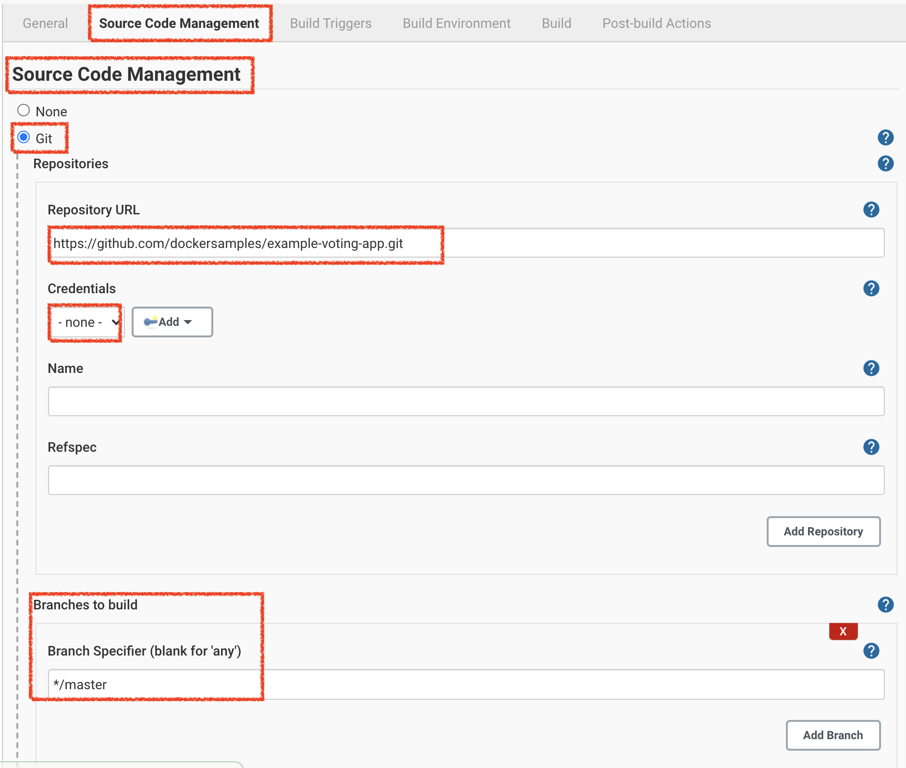
  - specify the details of the version control repository for building your source code
- Build Triggers
  - Jenkins allows you to trigger builds automatically
  - options
    - Build after other projects are built
      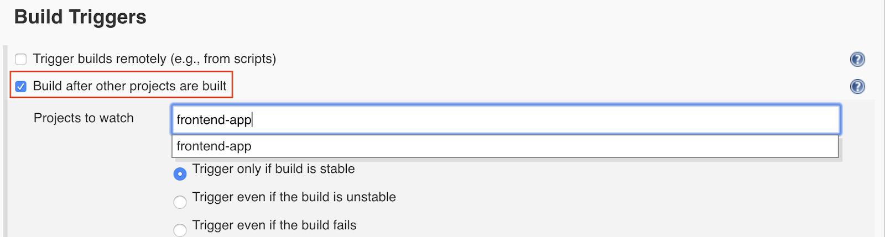
      - automatically build a project after another dependent project has been built successfully.
    - Build periodically: schedule periodic builds using cron-like syntax
    - Build when a change is pushed to BitBucket
      - Ideally, you would want to trigger a new build as soon as a source code change is detected so as to align with CI/CD goals. At the same time, you do __not__ want to add __polling overhead__. The best way to navigate this is to let your SCM system handle it by configuring Webhooks.
    - GitHub hook trigger for GITScm polling
    - Poll SCM: poll SCM at a certain frequency using cron-like syntax
    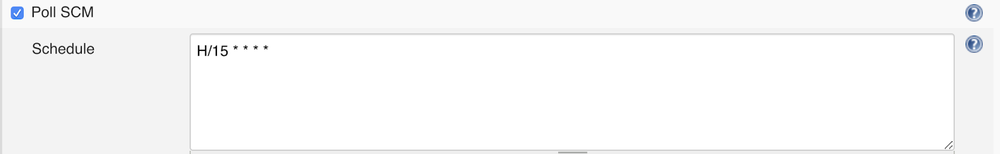
- Build Environment
  - clean up the workspace prior to starting a build ([Workspace plugin](https://plugins.jenkins.io/ws-cleanup/))
  - set up the required environment variables used in the build ([Credentials Binding plugin](https://plugins.jenkins.io/credentials-binding/))
  - abort builds that are stuck ([Timeout plugin](https://plugins.jenkins.io/build-timeout/))
  - add timestamps to the build logs ([Timestamper plugin](https://plugins.jenkins.io/timestamper/))
  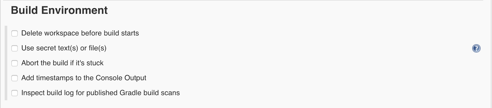
- Build
  - actual steps to __build your source code__, __run various tests__ (unit, integration, etc.), __code quality__, __code coverage__, and many more
  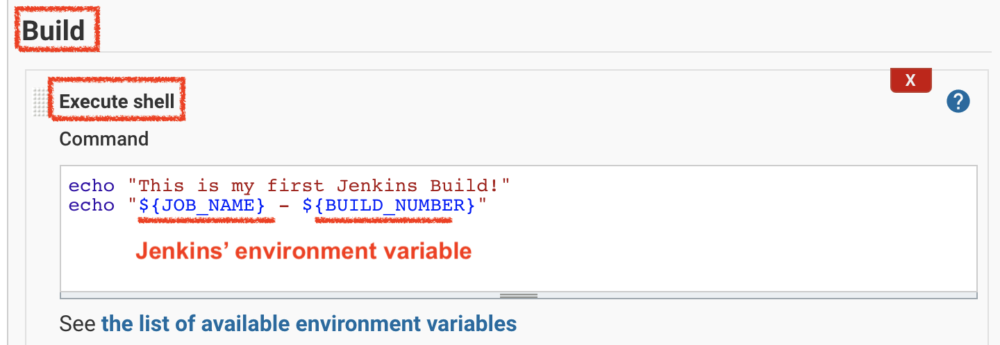
- Post-build Actions
  - notifying developers via email
  - push __build status__ and __git tag__ to git commit
  - publishing test reports
  - archiving build artifacts
  - triggering other build projects
  - automated deployment
  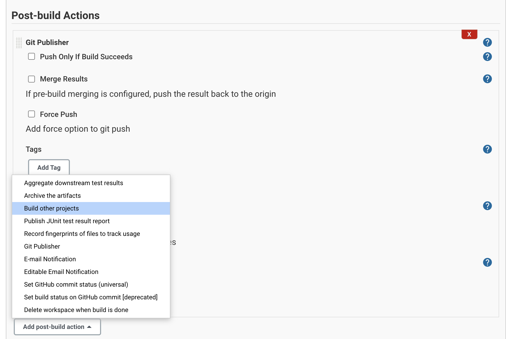
