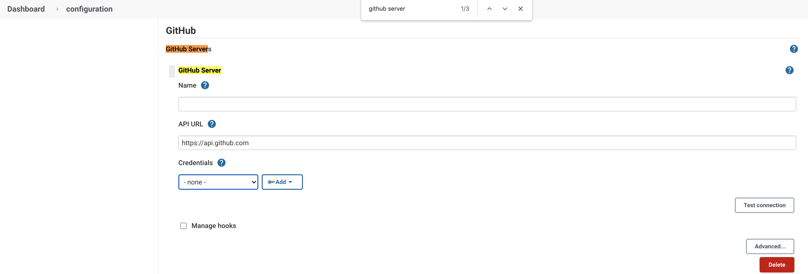

# 9. BEST PRACTICE DEMO: Create Jenkins Job that gets triggered by private Git commit, and push 1) git tag and 2) build status back to the git commit

Refs:
- https://stackoverflow.com/a/51003334/1528958
- https://docs.github.com/en/github/authenticating-to-github/keeping-your-account-and-data-secure/creating-a-personal-access-token


## 9.1 Create EC2 in Public Subnet (NOTE: only for demo to access Jenkins without load balancer)

## 9.2 Create Security Group and Allow Port 22 and 8080

## 9.3 Configure Jenkins Credential for ssh key so that Jenkins can pull from private Git repo

# 9.4 Install git to Jenkins server (git plugin should also be installed already)

If you try to use git without installing git, you will face an error like `GitException: could not init`:


SSH into a server and install git
```sh
# after ssh into a Jenkins server
sudo yum install git -y

which git # (not needed) set this path to git path in Manage Jenkins > Global Tool Configuration > Git / Path to Git executable. https://stackoverflow.com/a/42703766/1528958
sudo service jenkins restart
```

It should look like this after installing git:


## 9.5 Configure Git Webhooks to Push to Jenkins endpoint whenever a commit is pushed


## 9.6 Configure Jenkins Job Build Trigger


## 9.7 Generic job that prints out job name and build name

```sh
echo "First Build!"
echo "${JOB_NAME} - #${BUILD_NUMBER}"
```

## 9.8 Configure Git Publisher to push tags to git commit


## 9.9 Commit something to test if git triggers Jenkins build automatically


Check git tag is added to the Git commit:


## 9.10 Configure Github Commit Status (universal) on Jenkins Job


## 9.11. Generate Git's Personal Access Token (password) for Jenkins to get authenticated to Git


## 9.12 Configure Git server on Manage Jenkins > Configure System



## 9.13 Check Git Commit has build status icon


